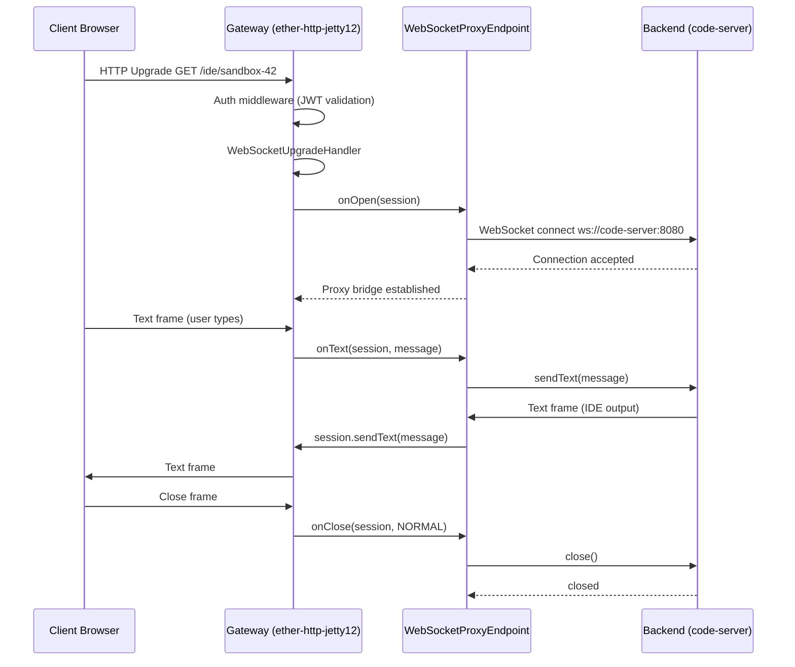

# ether-websocket-proxy-jetty12

WebSocket reverse-proxy endpoint for the Ether ecosystem. Bridges client WebSocket connections to backend servers through the HTTP-server handler chain, enabling transparent WebSocket proxying behind the same auth, rate-limiting, and middleware stack as regular HTTP routes.

## Coordinates

```xml
<dependency>
    <groupId>dev.rafex.ether.websocket</groupId>
    <artifactId>ether-websocket-proxy-jetty12</artifactId>
    <version>9.5.5-SNAPSHOT</version>
</dependency>
```

---

## Package overview

All public types live in `dev.rafex.ether.websocket.proxy.jetty12`.

| Type | Kind | Role |
|---|---|---|
| `WebSocketProxyEndpoint` | Class | Bidirectional WebSocket bridge (client ↔ backend) |
| `BackendResolver` | Functional Interface | Resolves `WebSocketSession` → backend `URI` |

---

## Quick start

### 1. Register as a WebSocket route in any `JettyModule`

```java
import dev.rafex.ether.http.jetty12.JettyModule;
import dev.rafex.ether.http.jetty12.JettyModuleContext;
import dev.rafex.ether.websocket.core.WebSocketRoute;
import dev.rafex.ether.websocket.proxy.jetty12.BackendResolver;
import dev.rafex.ether.websocket.proxy.jetty12.WebSocketProxyEndpoint;

import java.net.URI;
import java.util.List;

public final class CodeServerModule implements JettyModule {

    @Override
    public void registerWebSocketRoutes(final List<WebSocketRoute> routes,
                                        final JettyModuleContext context) {
        var proxy = new WebSocketProxyEndpoint(
            BackendResolver.fixed(URI.create("ws://code-server:8080"))
        );

        routes.add(WebSocketRoute.of("/ide/{sandboxId}", proxy));
    }
}
```

### 2. Wire into the server

```java
var config = JettyServerConfig.fromEnv();
var jsonCodec = JsonCodecBuilder.strict().build();
var modules = List.of(new CodeServerModule());

var runner = JettyServerFactory.create(config, jsonCodec, null, modules);
runner.start();
runner.join();
```

### 3. Connect from the browser

```javascript
// The proxy transparently forwards to ws://code-server:8080
new WebSocket("wss://gateway.example.com/ide/sandbox-42");
```

---

## BackendResolver strategies

### Fixed backend

```java
var resolver = BackendResolver.fixed(URI.create("ws://backend:8080"));
```

### Path-based routing

```java
BackendResolver resolver = session -> {
    var sandboxId = session.pathParam("sandboxId");
    return URI.create("ws://sandbox-" + sandboxId + ":8080");
};
```

### Header/token-based routing

```java
BackendResolver resolver = session -> {
    var target = session.headerFirst("X-Backend-Target");
    return target != null ? URI.create(target) : null;
};
```

---

## Architecture



---

## Handler chain position

WebSocket upgrade requests traverse the full middleware chain before reaching the proxy:

```
GracefulHandler
  → ThreadLimitHandler
    → QoSHandler
      → SizeLimitHandler
        → ObservabilityHandler
        → RateLimitHandler
        → IpPolicyHandler
        → CorsHandler
        → SecurityHeadersHandler
        → AuthHandler (JWT validation)
          → WebSocketUpgradeHandler
            → WebSocketProxyEndpoint
            → ... (other WS endpoints)
            → PathMappingsHandler (HTTP routes)
```

---

## License

MIT License — Copyright (c) 2025–2026 Raúl Eduardo González Argote
