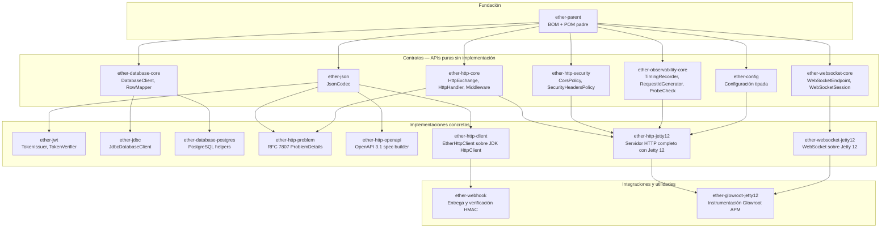
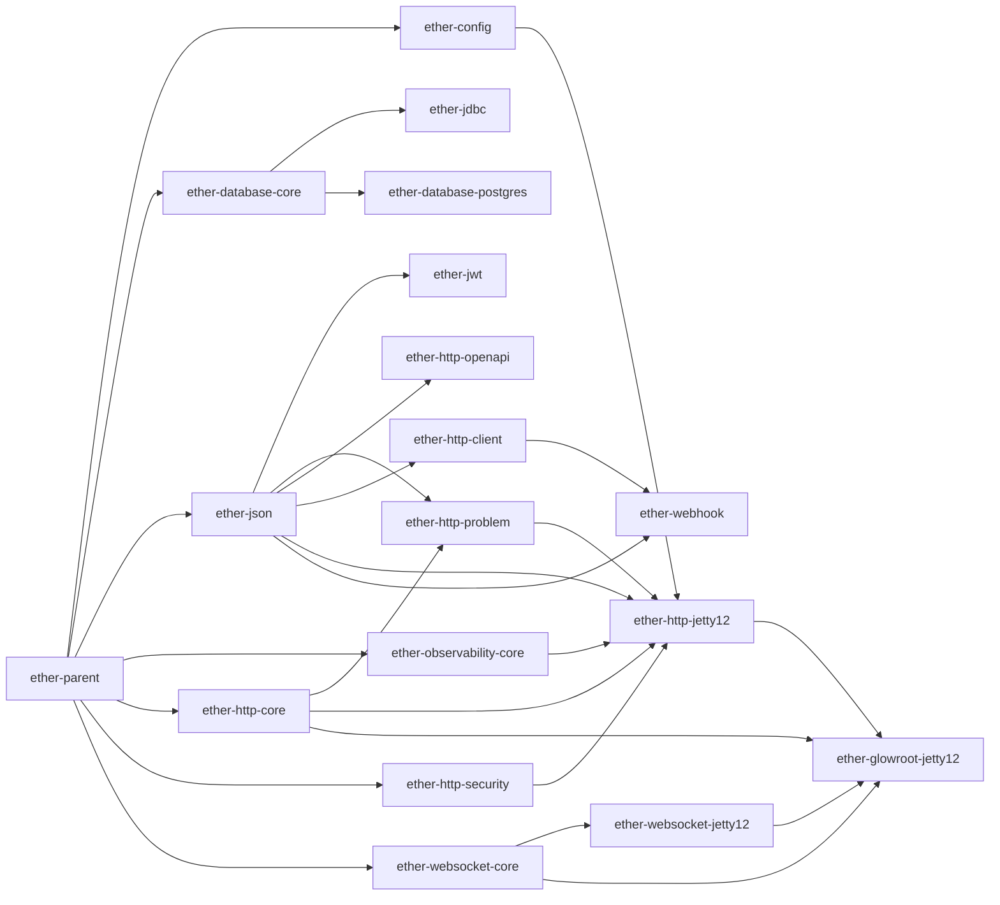
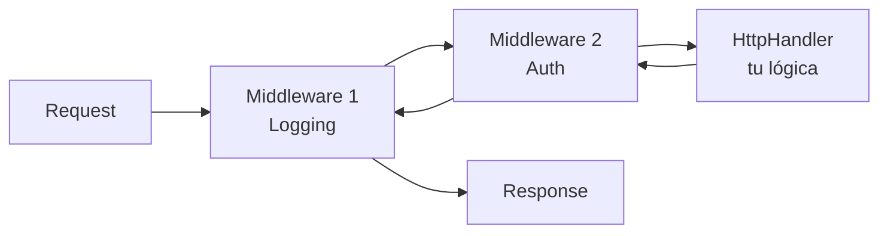
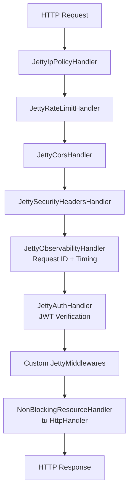
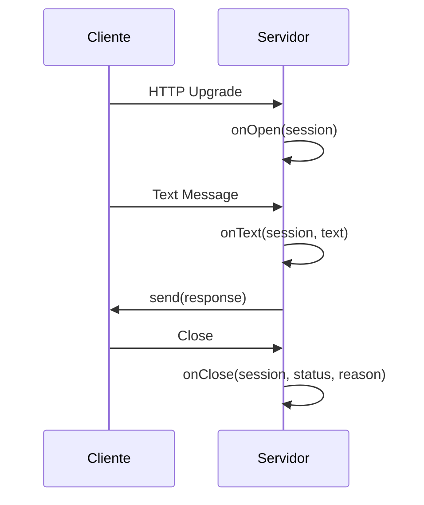
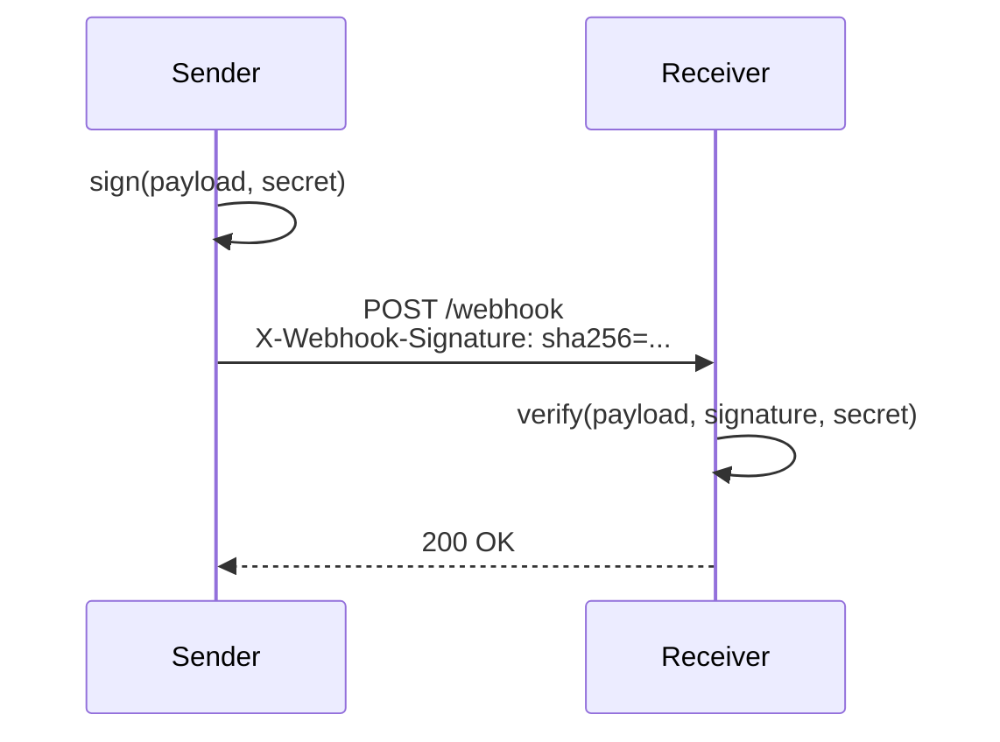
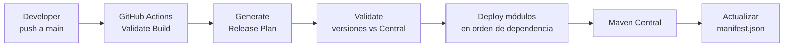

# Ether Central Publishing Hub


## Estado en Maven Central

### Tabla de estado (con badge por modulo)

| Modulo | Badge | GroupId | ArtifactId | Desplegado |
|---|---|---|---|---|
| ether-parent |  | dev.rafex.ether.parent | ether-parent | si |
| ether-config |  | dev.rafex.ether.config | ether-config | no |
| ether-database-core |  | dev.rafex.ether.database | ether-database-core | no |
| ether-jdbc |  | dev.rafex.ether.jdbc | ether-jdbc | si |
| ether-database-postgres |  | dev.rafex.ether.database | ether-database-postgres | no |
| ether-json |  | dev.rafex.ether.json | ether-json | si |
| ether-jwt |  | dev.rafex.ether.jwt | ether-jwt | si |
| ether-observability-core |  | dev.rafex.ether.observability | ether-observability-core | no |
| ether-http-core |  | dev.rafex.ether.http | ether-http-core | si |
| ether-http-security |  | dev.rafex.ether.http | ether-http-security | no |
| ether-http-problem |  | dev.rafex.ether.http | ether-http-problem | no |
| ether-http-openapi |  | dev.rafex.ether.http | ether-http-openapi | no |
| ether-http-client |  | dev.rafex.ether.http | ether-http-client | no |
| ether-http-jetty12 |  | dev.rafex.ether.http | ether-http-jetty12 | si |
| ether-websocket-core |  | dev.rafex.ether.websocket | ether-websocket-core | si |
| ether-websocket-jetty12 |  | dev.rafex.ether.websocket | ether-websocket-jetty12 | si |
| ether-webhook |  | dev.rafex.ether.webhook | ether-webhook | no |
| ether-glowroot-jetty12 |  | dev.rafex.ether.glowroot | ether-glowroot-jetty12 | si |

### JSON de estado

Consulta el archivo [docs/maven-central-status.json](docs/maven-central-status.json).

---

## ¿Qué es Ether?

**Ether** es un ecosistema de bibliotecas Java modulares para construir microservicios y APIs sin frameworks pesados. Cada módulo es independiente, tiene cero magia, y puede adoptarse de forma incremental.

```
Sin Spring. Sin Quarkus. Sin Micronaut.
Solo Java 21, Jetty 12 y las partes que realmente necesitas.
```

### Principios de diseño

- **Interfaces primero** — cada capa expone contratos, no implementaciones
- **Cero magia** — sin reflexión en tiempo de ejecución, sin anotaciones de framework
- **Modular** — usa solo los módulos que necesitas; sin transitive bloat
- **Testeable** — todas las interfaces son fáciles de mockear; no hay statics ocultos
- **Java 21** — records, sealed classes, pattern matching, virtual threads

---

## Arquitectura del ecosistema



---

## Grafo de dependencias de despliegue

El orden importa — cada módulo necesita que sus dependencias estén en Maven Central primero:



---

## Módulos

### 🏗 Fundación

#### [`ether-parent`](ether-parent/README.md)
POM padre y BOM del ecosistema. Gestiona versiones de todas las dependencias externas (Jackson, Jetty, Glowroot). Todos los módulos de ether lo usan como padre.

```xml
<parent>
  <groupId>dev.rafex.ether.parent</groupId>
  <artifactId>ether-parent</artifactId>
  <version>8.0.0</version>
  <relativePath/>
</parent>
```

---

### ⚙️ Configuración

#### [`ether-config`](ether-config/README.md)
Configuración tipada con fuentes apilables (YAML, JSON, TOML, properties, env vars, system properties) y binding directo a records de Java con validación.

```java
// Define tu config como un record
record ServerConfig(
    @Required String host,
    @Min(1) @Max(65535) int port,
    @NotBlank String databaseUrl
) {}

// Carga y valida
var config = EtherConfig.builder()
    .source(new YamlFileConfigSource("config.yaml"))
    .source(new EnvironmentConfigSource())   // env override
    .build()
    .bind("server", ServerConfig.class);
```

---

### 🗄 Acceso a datos

#### [`ether-database-core`](ether-database-core/README.md)
Contratos JDBC-first: `DatabaseClient`, `RowMapper`, `TransactionRunner`. Sin implementación — define el contrato que usas en tu código.

#### [`ether-jdbc`](ether-jdbc/README.md)
Implementación JDBC de `ether-database-core`. Sin Spring, sin Hibernate, sin pool externo obligatorio.

```java
var client = new JdbcDatabaseClient(dataSource);
var users = client.query(
    "SELECT * FROM users WHERE active = ?",
    List.of(true),
    rs -> new User(rs.getLong("id"), rs.getString("name"))
);
```

#### [`ether-database-postgres`](ether-database-postgres/README.md)
Clasificador de errores PostgreSQL y constantes de SQL states para manejar `unique_violation`, `foreign_key_violation`, etc. de forma limpia.

---

### 📦 Serialización

#### [`ether-json`](ether-json/README.md)
Interfaz `JsonCodec` sobre Jackson. Intercambia la implementación sin tocar tu código.

```java
JsonCodec codec = new JacksonJsonCodec();

// Serializar
String json = codec.write(new User(1L, "Alice"));

// Deserializar
User user = codec.read(json, User.class);

// Tipos genéricos
List<User> users = codec.read(json, new TypeReference<List<User>>() {});
```

---

### 🔐 Seguridad

#### [`ether-jwt`](ether-jwt/README.md)
Emisión y verificación de JWT. Soporta HS256, RS256, ES256.

```java
var config = JwtConfig.builder()
    .algorithm(JwtAlgorithm.HS256)
    .secret("tu-secreto-de-256-bits")
    .issuer("tu-servicio")
    .ttlSeconds(3600)
    .build();

TokenIssuer issuer = new DefaultTokenIssuer(config);
TokenVerifier verifier = new DefaultTokenVerifier(config);

// Emitir
String token = issuer.issue(TokenSpec.forSubject("user-123")
    .claim("roles", List.of("admin"))
    .build());

// Verificar
var result = verifier.verify(token);
if (result.isOk()) {
    String subject = result.claims().subject();
}
```

---

### 🔭 Observabilidad

#### [`ether-observability-core`](ether-observability-core/README.md)
Interfaces puras: `RequestIdGenerator`, `TimingRecorder`, `ProbeCheck`. Tu código depende solo de estas interfaces — el APM concreto se inyecta como implementación.

```java
// Health check que se expone en /health
var aggregator = new ProbeAggregator(List.of(
    ProbeCheck.named("database", () -> db.ping()),
    ProbeCheck.named("cache",    () -> cache.ping())
));
ProbeReport report = aggregator.run(ProbeKind.READINESS);
// report.status() → UP | DOWN | DEGRADED
```

---

### 🌐 HTTP

#### [`ether-http-core`](ether-http-core/README.md)
Contratos del pipeline HTTP: `HttpExchange`, `HttpHandler`, `Middleware`. Sin Jetty, sin Servlet — puro Java.

```java
// Un handler es una función HttpExchange → HttpExchange
HttpHandler users = exchange -> exchange.json(200, userService.findAll());

// Un middleware envuelve handlers
Middleware logging = next -> exchange -> {
    System.out.println(exchange.method() + " " + exchange.path());
    return next.handle(exchange);
};
```



#### [`ether-http-security`](ether-http-security/README.md)
Records inmutables para configurar CORS, security headers, allowlist de IPs y rate limiting.

```java
var profile = HttpSecurityProfile.builder()
    .cors(CorsPolicy.builder()
        .allowOrigin("https://miapp.com")
        .allowMethods("GET", "POST", "PUT", "DELETE")
        .build())
    .securityHeaders(SecurityHeadersPolicy.strict())
    .rateLimit(RateLimitPolicy.of(100, Duration.ofMinutes(1)))
    .build();
```

#### [`ether-http-problem`](ether-http-problem/README.md)
Respuestas de error RFC 7807 (`application/problem+json`).

```json
{
  "type": "https://miapi.com/errors/not-found",
  "title": "Resource Not Found",
  "status": 404,
  "detail": "User with id 42 does not exist",
  "instance": "/users/42"
}
```

#### [`ether-http-openapi`](ether-http-openapi/README.md)
Construye especificaciones OpenAPI 3.1 programáticamente y expónlas en `/openapi.json`.

#### [`ether-http-client`](ether-http-client/README.md)
Cliente HTTP saliente sobre `java.net.http`. GET, POST, PUT, DELETE con serialización JSON automática.

#### [`ether-http-jetty12`](ether-http-jetty12/README.md) ⭐
El módulo principal para construir servidores HTTP. Integra todos los módulos anteriores en un servidor Jetty 12 listo para producción.



```java
var server = JettyServerFactory.create(
    JettyServerConfig.of(8080),
    routes,
    codec,
    tokenVerifier,
    securityProfile,
    new UuidRequestIdGenerator(),
    sample -> log.info("{} took {}ms", sample.operation(), sample.durationMillis()),
    List.of(glowrootHandler::wrap)
);
```

---

### 🔌 WebSocket

#### [`ether-websocket-core`](ether-websocket-core/README.md)
Contratos agnósticos al transporte: `WebSocketEndpoint`, `WebSocketSession`.



#### [`ether-websocket-jetty12`](ether-websocket-jetty12/README.md)
Implementación WebSocket sobre Jetty 12. Se integra en el mismo servidor que `ether-http-jetty12`.

---

### 🔗 Integraciones

#### [`ether-webhook`](ether-webhook/README.md)
Envío y verificación de webhooks con firma HMAC-SHA256.



#### [`ether-glowroot-jetty12`](ether-glowroot-jetty12/README.md)
Instrumentación Glowroot APM para Jetty 12. Registra transacciones, tiempos de respuesta, usuarios autenticados y request IDs sin modificar tu código de negocio.

```java
var glowroot = GlowrootJettyHandler.builder()
    .healthPath("/health")
    .requestIdHeader("X-Request-Id")
    .defaultSlowThreshold(2_000)
    .userExtractor(ctx -> ctx instanceof AuthContext a ? a.subject() : null)
    .build();

// Se registra como JettyMiddleware — una sola línea en tu server setup
List.of(glowroot::wrap)
```

---

## Objetivo del Repositorio

Este repositorio actúa como un hub orquestador para la publicación y despliegue automáticos de los módulos de **Ether** en **Maven Central**.



Incluye:
- Detección automática de cambios por submódulo (git diff)
- Release plan con bump semántico de versiones
- Validación de colisiones de versión contra Maven Central
- Despliegue en orden estricto de dependencias
- Generación de Javadoc, fuentes y firmas GPG
- Actualización automática del manifest tras despliegue exitoso

---

## Cómo compilar y publicar

### Instalar todo localmente

```bash
make install-all
```

### Validar compilación (equivalente a CI)

```bash
make validate-main-build
```

### Compilar un módulo puntual con sus dependencias

```bash
make compile-ether-http-jetty12
make compile-ether-glowroot-jetty12
```

### Generar release plan

```bash
# Detecta cambios automáticamente desde el último commit
make release-plan

# Forzar todos los módulos (desde el primer commit del repo)
FIRST=$(git rev-list --max-parents=0 HEAD)
make release-plan BASE_REF=$FIRST
```

### Desplegar en Maven Central via GitHub Actions

```bash
# dry-run — genera el plan pero no despliega
make publish-plan-ci

# deploy real — todos los módulos con cambios
make publish-ci

# deploy forzado — todos los 18 módulos
FIRST=$(git rev-list --max-parents=0 HEAD)
make publish-ci BASE_REF=$FIRST
```

---

## Uso en tu proyecto

### Con ether-parent como POM padre

```xml
<parent>
  <groupId>dev.rafex.ether.parent</groupId>
  <artifactId>ether-parent</artifactId>
  <version>8.0.0</version>
  <relativePath/>
</parent>

<dependencies>
  <!-- Servidor HTTP completo -->
  <dependency>
    <groupId>dev.rafex.ether.http</groupId>
    <artifactId>ether-http-jetty12</artifactId>
  </dependency>

  <!-- WebSocket -->
  <dependency>
    <groupId>dev.rafex.ether.websocket</groupId>
    <artifactId>ether-websocket-jetty12</artifactId>
  </dependency>

  <!-- APM con Glowroot (provided — requiere -javaagent) -->
  <dependency>
    <groupId>dev.rafex.ether.glowroot</groupId>
    <artifactId>ether-glowroot-jetty12</artifactId>
  </dependency>
</dependencies>
```

### Con ether-parent como BOM (sin heredar)

```xml
<dependencyManagement>
  <dependencies>
    <dependency>
      <groupId>dev.rafex.ether.parent</groupId>
      <artifactId>ether-parent</artifactId>
      <version>8.0.0</version>
      <type>pom</type>
      <scope>import</scope>
    </dependency>
  </dependencies>
</dependencyManagement>
```

---

## Ejemplo completo — servidor de producción mínimo

```java
public class Application {

    public static void main(String[] args) throws Exception {
        // 1. Configuración
        var config = EtherConfig.builder()
            .source(new YamlFileConfigSource("config.yaml"))
            .source(new EnvironmentConfigSource())
            .build()
            .bind("app", AppConfig.class);

        // 2. Infraestructura
        var codec    = new JacksonJsonCodec();
        var verifier = new DefaultTokenVerifier(JwtConfig.fromConfig(config));

        // 3. Seguridad
        var security = HttpSecurityProfile.builder()
            .cors(CorsPolicy.allowOrigin(config.allowedOrigin()))
            .securityHeaders(SecurityHeadersPolicy.strict())
            .build();

        // 4. Rutas
        var routes = List.of(
            EtherRoute.get("/health",    new HealthResource()),
            EtherRoute.get("/users",     new ListUsersHandler(userRepo)),
            EtherRoute.get("/users/:id", new GetUserHandler(userRepo)),
            EtherRoute.post("/users",    new CreateUserHandler(userRepo))
        );

        // 5. Instrumentación Glowroot (opcional)
        var glowroot = GlowrootJettyHandler.builder()
            .healthPath("/health")
            .requestIdHeader("X-Request-Id")
            .defaultSlowThreshold(2_000)
            .build();

        // 6. Servidor
        var server = JettyServerFactory.create(
            JettyServerConfig.of(config.port()),
            routes, codec, verifier, security,
            new UuidRequestIdGenerator(),
            new Slf4jTimingRecorder(),
            List.of(glowroot::wrap)
        );

        // 7. Arranque con shutdown graceful
        new JettyServerRunner(server).start();
    }
}
```
