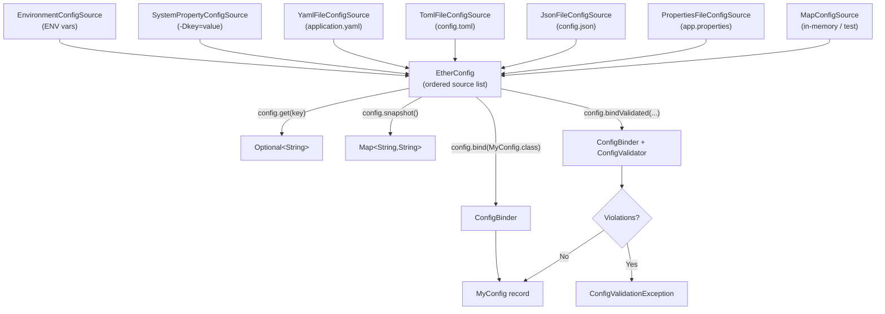

# ether-config

**Group ID:** `dev.rafex.ether.config`
**Artifact ID:** `ether-config`
**Packaging:** `jar`
**License:** MIT

`ether-config` is a typed, layered configuration library for Java 21. It lets you compose multiple configuration sources — environment variables, system properties, `.properties` files, YAML, TOML, JSON — into a single lookup with deterministic precedence. Values are bound directly to immutable Java `record` types and can be validated with lightweight annotations before your application starts.

There are no frameworks, no DI container, and no annotation processors required.

---

## Table of Contents

1. [Maven dependency](#maven-dependency)
2. [Architecture overview](#architecture-overview)
3. [Configuration sources](#configuration-sources)
4. [EtherConfig: composing sources](#etherconfig-composing-sources)
5. [Binding to Java records](#binding-to-java-records)
6. [Validation annotations](#validation-annotations)
7. [Layered sources with environment override](#layered-sources-with-environment-override)
8. [YAML configuration file](#yaml-configuration-file)
9. [TOML configuration file](#toml-configuration-file)
10. [JSON configuration file](#json-configuration-file)
11. [Nested records and collections](#nested-records-and-collections)
12. [Fail-fast validation on startup](#fail-fast-validation-on-startup)
13. [ConfigAlias and ConfigPrefix](#configalias-and-configprefix)
14. [Snapshot](#snapshot)
15. [Supported conversion types](#supported-conversion-types)

---

## Maven dependency

```xml
<dependency>
    <groupId>dev.rafex.ether.config</groupId>
    <artifactId>ether-config</artifactId>
    <version>8.0.0-SNAPSHOT</version>
</dependency>
```

If your project inherits from `ether-parent` or imports it as a BOM, omit the `<version>` tag.

---

## Architecture overview



Sources are evaluated in the order they are added to `EtherConfig`. The first source that contains a key wins. This means you list higher-priority sources first — typically environment variables before files.

---

## Configuration sources

| Class | Description |
|---|---|
| `EnvironmentConfigSource` | Reads `System.getenv()`. Maps `SERVER_PORT` to `server.port` automatically. |
| `SystemPropertyConfigSource` | Reads `System.getProperties()`. |
| `YamlFileConfigSource` | Reads a YAML file and flattens nested keys with dot notation. |
| `TomlFileConfigSource` | Reads a TOML file and flattens keys. |
| `JsonFileConfigSource` | Reads a JSON object file and flattens keys. |
| `PropertiesFileConfigSource` | Reads a `.properties` file. |
| `MapConfigSource` | Wraps any `Map<String, String>` — useful in tests. |
| `ReloadableConfigSource` | Wraps a file-backed source and reloads it via `WatchService`. |
| `SecretConfigSource` | Delegates to a `SecretProvider` (e.g. AWS Secrets Manager). |

All sources implement the `ConfigSource` interface:

```java
public interface ConfigSource {
    String name();
    Optional<String> get(String key);
    Map<String, String> entries();
}
```

---

## EtherConfig: composing sources

```java
import dev.rafex.ether.config.EtherConfig;
import dev.rafex.ether.config.sources.EnvironmentConfigSource;
import dev.rafex.ether.config.sources.SystemPropertyConfigSource;
import dev.rafex.ether.config.sources.YamlFileConfigSource;

import java.nio.file.Path;

// Higher-priority sources first
var config = EtherConfig.of(
    new EnvironmentConfigSource(),
    new SystemPropertyConfigSource(),
    new YamlFileConfigSource(Path.of("config/application.yaml"))
);

// Lookup a single key
var port = config.get("server.port").orElse("8080");

// Require a key — throws IllegalArgumentException if absent
var secret = config.require("jwt.secret");
```

---

## Binding to Java records

`ConfigBinder` uses reflection to match record component names to configuration keys, then converts the string values to the correct Java types. The binding is done at construction time — the resulting record is immutable.

### Define a config record

```java
import dev.rafex.ether.config.annotations.ConfigPrefix;
import dev.rafex.ether.config.validation.Required;
import dev.rafex.ether.config.validation.NotBlank;
import dev.rafex.ether.config.validation.Min;
import dev.rafex.ether.config.validation.Max;
import dev.rafex.ether.config.validation.Size;

@ConfigPrefix("server")
public record ServerConfig(
    @Required @NotBlank String host,
    @Min(1) @Max(65535) int port,
    @Min(1) @Max(200) int maxThreads,
    boolean ssl
) {}
```

### Bind from config

```java
var config = EtherConfig.of(
    new EnvironmentConfigSource(),
    new YamlFileConfigSource(Path.of("application.yaml"))
);

// Bind — uses @ConfigPrefix("server") automatically
ServerConfig server = config.bind(ServerConfig.class);

System.out.println(server.host());       // "0.0.0.0"
System.out.println(server.port());       // 8080
System.out.println(server.maxThreads()); // 32
```

The corresponding YAML section:

```yaml
server:
  host: "0.0.0.0"
  port: 8080
  maxThreads: 32
  ssl: false
```

---

## Validation annotations

`ether-config` provides its own lightweight validation annotations. They are applied to record components and checked by `ConfigValidator`. No Jakarta Validation runtime is required.

| Annotation | Applies to | Behaviour |
|---|---|---|
| `@Required` | Any | Fails if the value is `null` after binding |
| `@NotBlank` | `String` | Fails if the value is blank or empty |
| `@Size(min, max)` | `String` | Fails if `length < min` or `length > max` |
| `@Min(value)` | Numeric | Fails if the value is below the minimum |
| `@Max(value)` | Numeric | Fails if the value is above the maximum |
| `@Pattern(regexp)` | `String` | Fails if the value does not match the regex |
| `@Valid` | Nested record | Triggers recursive validation of a nested record |

```java
import dev.rafex.ether.config.validation.Required;
import dev.rafex.ether.config.validation.NotBlank;
import dev.rafex.ether.config.validation.Size;
import dev.rafex.ether.config.validation.Min;
import dev.rafex.ether.config.validation.Max;
import dev.rafex.ether.config.validation.Pattern;
import dev.rafex.ether.config.validation.Valid;
import dev.rafex.ether.config.annotations.ConfigPrefix;

@ConfigPrefix("database")
public record DatabaseConfig(
    @Required @NotBlank String url,
    @Required @NotBlank String username,
    @Required @Size(min = 8, max = 128) String password,
    @Min(1) @Max(50) int poolSize,
    @Pattern(regexp = "^(postgres|mysql|h2)$") String dialect,
    @Valid ConnectionPoolConfig pool
) {}

@ConfigPrefix("pool")
public record ConnectionPoolConfig(
    @Min(1) int minIdle,
    @Min(1) @Max(100) int maxSize,
    @NotBlank String validationQuery
) {}
```

---

## Layered sources with environment override

The most common production pattern places environment variables first so that container or Kubernetes environment values override what is in the committed YAML file.

```java
import dev.rafex.ether.config.EtherConfig;
import dev.rafex.ether.config.sources.*;

import java.nio.file.Path;

// Environment variables win over YAML defaults
var config = EtherConfig.of(
    new EnvironmentConfigSource(),           // highest priority
    new SystemPropertyConfigSource(),        // -D flags
    new YamlFileConfigSource(
        Path.of("config/application.yaml")) // lowest priority
);

// In production: SERVER_PORT=9090 in the container overrides port: 8080 in YAML
var port = config.get("server.port").orElse("8080");
```

`EnvironmentConfigSource` translates environment variable names automatically:

| Environment variable | Config key resolved |
|---|---|
| `SERVER_PORT` | `server.port` |
| `DATABASE_URL` | `database.url` |
| `JWT_SECRET` | `jwt.secret` |
| `HTTP_MAX_THREADS` | `http.max.threads` |

---

## YAML configuration file

```yaml
# config/application.yaml
server:
  host: "0.0.0.0"
  port: 8080
  maxThreads: 32
  ssl: false

database:
  url: "jdbc:postgresql://localhost:5432/mydb"
  username: "app"
  password: "changeme"
  poolSize: 10
  dialect: "postgres"

jwt:
  secret: "super-secret-key-that-is-at-least-32-chars"
  issuer: "auth.example.com"
  ttlSeconds: 3600
```

Load and bind in Java:

```java
var config = EtherConfig.of(
    new EnvironmentConfigSource(),
    new YamlFileConfigSource(Path.of("config/application.yaml"))
);

var server   = config.bind(ServerConfig.class);
var database = config.bind(DatabaseConfig.class);
```

---

## TOML configuration file

```toml
# config/application.toml
[server]
host = "0.0.0.0"
port = 8080
maxThreads = 32
ssl = false

[database]
url = "jdbc:postgresql://localhost:5432/mydb"
username = "app"
password = "changeme"
poolSize = 10
```

Load the TOML file:

```java
var config = EtherConfig.of(
    new EnvironmentConfigSource(),
    new TomlFileConfigSource(Path.of("config/application.toml"))
);

var server = config.bind(ServerConfig.class);
```

---

## JSON configuration file

```json
{
  "server": {
    "host": "0.0.0.0",
    "port": 8080,
    "maxThreads": 32,
    "ssl": false
  },
  "database": {
    "url": "jdbc:postgresql://localhost:5432/mydb",
    "username": "app",
    "poolSize": 10
  }
}
```

```java
var config = EtherConfig.of(
    new EnvironmentConfigSource(),
    new JsonFileConfigSource(Path.of("config/application.json"))
);
```

---

## Nested records and collections

`ConfigBinder` supports nested records, `List<T>`, and `Map<String, T>` using dot notation for the keys in configuration files.

### Nested record

```java
public record AppConfig(
    ServerConfig server,
    DatabaseConfig database
) {}
```

```yaml
server:
  host: "localhost"
  port: 8080

database:
  url: "jdbc:postgresql://localhost:5432/mydb"
  username: "app"
```

```java
// Bind the whole tree in one call
AppConfig app = config.bind(AppConfig.class);
String host = app.server().host();
```

### List of strings (comma-separated)

```yaml
allowed:
  origins: "https://a.com,https://b.com,https://c.com"
```

```java
public record CorsConfig(
    List<String> origins
) {}

var cors = config.bind("allowed", CorsConfig.class);
// cors.origins() → ["https://a.com", "https://b.com", "https://c.com"]
```

### List of records (indexed notation)

```yaml
datasources[0].url: "jdbc:postgresql://primary:5432/db"
datasources[0].readonly: false
datasources[1].url: "jdbc:postgresql://replica:5432/db"
datasources[1].readonly: true
```

```java
public record DataSourceEntry(String url, boolean readonly) {}

public record MultiDbConfig(List<DataSourceEntry> datasources) {}

var multiDb = config.bind(MultiDbConfig.class);
```

### Map of strings

```yaml
features.payments: true
features.reports: false
features.beta: true
```

```java
public record FeatureFlags(Map<String, Boolean> features) {}

var flags = config.bind(FeatureFlags.class);
// flags.features() → {"payments": true, "reports": false, "beta": true}
```

---

## Fail-fast validation on startup

Call `bindValidated` instead of `bind` to run all validation annotations immediately after binding. If any constraint is violated, a `ConfigValidationException` is thrown before your service starts accepting traffic.

```java
import dev.rafex.ether.config.EtherConfig;
import dev.rafex.ether.config.exceptions.ConfigValidationException;
import dev.rafex.ether.config.sources.EnvironmentConfigSource;
import dev.rafex.ether.config.sources.YamlFileConfigSource;

import java.nio.file.Path;

public final class Application {

    public static void main(String[] args) {
        var config = EtherConfig.of(
            new EnvironmentConfigSource(),
            new YamlFileConfigSource(Path.of("config/application.yaml"))
        );

        // Throws ConfigValidationException on the first bad value
        ServerConfig server;
        try {
            server = config.bindValidated(ServerConfig.class);
        } catch (ConfigValidationException e) {
            System.err.println("Invalid configuration:");
            for (var violation : e.violations()) {
                System.err.println("  " + violation.field() + ": " + violation.message());
            }
            System.exit(1);
            return;
        }

        System.out.println("Server starting on " + server.host() + ":" + server.port());
        // ... start Jetty or whatever server
    }
}
```

---

## ConfigAlias and ConfigPrefix

### @ConfigPrefix

Annotate a record with `@ConfigPrefix` to automatically prepend a namespace to all key lookups. This avoids repeating the prefix in every `bind()` call.

```java
@ConfigPrefix("http")
public record HttpConfig(
    String host,
    int port
) {}

// These two calls are equivalent:
HttpConfig a = config.bind(HttpConfig.class);          // uses prefix from annotation
HttpConfig b = config.bind("http", HttpConfig.class);  // explicit prefix
```

### @ConfigAlias

Use `@ConfigAlias` on a record component to map it to a different key name in configuration — useful for legacy key names or keys that do not match Java naming conventions.

```java
public record DatabaseConfig(
    @ConfigAlias("db.url") String url,
    @ConfigAlias("db.max-pool-size") int maxPoolSize
) {}
```

The binder looks up `db.url` and `db.max-pool-size` from config and assigns them to `url` and `maxPoolSize` respectively.

---

## Snapshot

`EtherConfig.snapshot()` returns an immutable `Map<String, String>` that represents the merged view of all sources. Higher-priority source entries shadow lower-priority ones (first-wins). This is useful for debugging or serialising the final configuration state.

```java
var config = EtherConfig.of(
    new EnvironmentConfigSource(),
    new YamlFileConfigSource(Path.of("application.yaml"))
);

Map<String, String> snapshot = config.snapshot();

// Print all resolved config keys and values
snapshot.forEach((k, v) -> System.out.println(k + " = " + v));
```

---

## Supported conversion types

`ConfigBinder` converts string values to the following Java types automatically:

| Java type | Example value |
|---|---|
| `String` | `"hello"` |
| `int` / `Integer` | `"8080"` |
| `long` / `Long` | `"1000000"` |
| `boolean` / `Boolean` | `"true"` / `"false"` |
| `double` / `Double` | `"3.14"` |
| `java.time.Duration` | `"PT15M"` (ISO-8601) |
| `java.net.URI` | `"https://example.com"` |
| Any `enum` | `"POSTGRES"` (case-insensitive) |
| Nested `record` | Via recursive binding |
| `List<T>` | Comma-separated or indexed keys |
| `Map<String, T>` | Dot-separated sub-keys |
