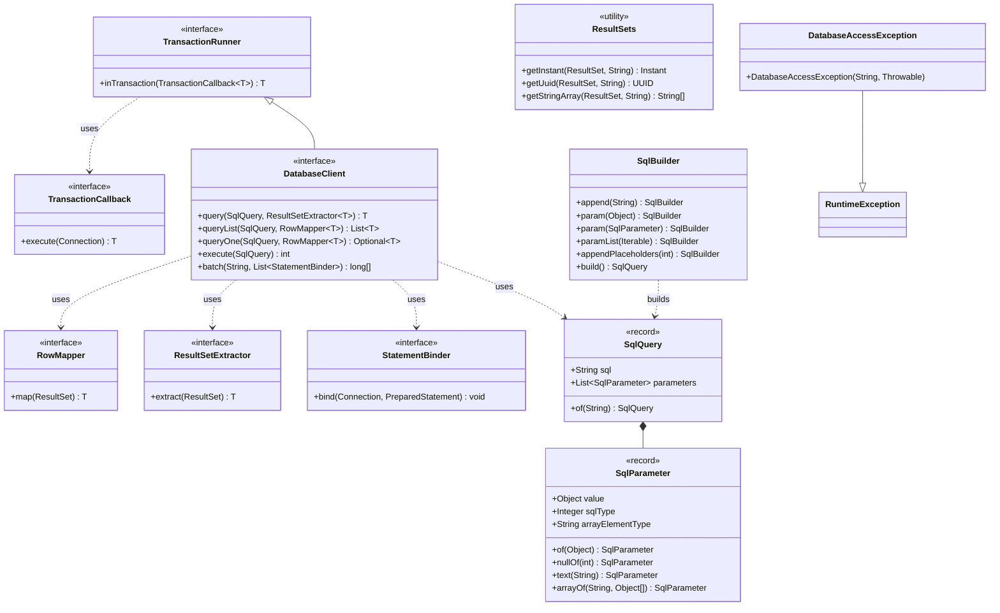

# ether-database-core

Minimal, framework-free database abstractions for the Ether stack. This module defines the contracts — interfaces, value types, and helpers — that all database implementations in the Ether ecosystem depend on. It has no runtime dependencies beyond the Java standard library.

## Design Philosophy

- **JDBC-first, not ORM-first.** SQL is written by the developer, not generated.
- **Pure interfaces.** No connection pools, no migrations, no reflection-based mapping are included here.
- **Layered dependencies.** Other modules implement the contracts: `ether-database-core` → `ether-jdbc` → vendor-specific modules such as `ether-database-postgres`.
- **Java 21.** Records, sealed types, and pattern matching are used throughout.

## Maven Dependency

```xml
<dependency>
    <groupId>dev.rafex.ether.database</groupId>
    <artifactId>ether-database-core</artifactId>
    <version>8.0.0-SNAPSHOT</version>
</dependency>
```

---

## Interface Hierarchy



---

## Package Layout

| Package | Contents |
|---|---|
| `dev.rafex.ether.database.core` | `DatabaseClient` interface |
| `dev.rafex.ether.database.core.exceptions` | `DatabaseAccessException` |
| `dev.rafex.ether.database.core.mapping` | `RowMapper`, `ResultSetExtractor`, `ResultSets` |
| `dev.rafex.ether.database.core.sql` | `SqlQuery`, `SqlParameter`, `SqlBuilder`, `StatementBinder` |
| `dev.rafex.ether.database.core.transaction` | `TransactionRunner`, `TransactionCallback` |

---

## Core Contracts

### DatabaseClient

The primary interface. Implementations (such as `JdbcDatabaseClient` from `ether-jdbc`) provide the actual connection management and execution.

```java
public interface DatabaseClient extends TransactionRunner {
    <T> T query(SqlQuery query, ResultSetExtractor<T> extractor);
    <T> List<T> queryList(SqlQuery query, RowMapper<T> mapper);
    <T> Optional<T> queryOne(SqlQuery query, RowMapper<T> mapper);
    int execute(SqlQuery query);
    long[] batch(String sql, List<StatementBinder> binders);
}
```

### TransactionRunner and TransactionCallback

`DatabaseClient` extends `TransactionRunner`, which exposes a single method:

```java
public interface TransactionRunner {
    <T> T inTransaction(TransactionCallback<T> callback);
}
```

`TransactionCallback` is a functional interface that receives a live `Connection`:

```java
@FunctionalInterface
public interface TransactionCallback<T> {
    T execute(Connection connection) throws SQLException;
}
```

### RowMapper vs ResultSetExtractor

| Type | Purpose |
|---|---|
| `RowMapper<T>` | Called once per row; maps the current row of a `ResultSet` to `T`. Used by `queryList` and `queryOne`. |
| `ResultSetExtractor<T>` | Called once with the full `ResultSet`; must iterate manually. Used by the lower-level `query` method. |

Both are `@FunctionalInterface`, so lambda expressions work directly.

---

## Example 1 — Implement a RowMapper for a User Record

Define a domain record and a reusable mapper for it:

```java
package com.example.users;

import java.time.Instant;
import java.util.UUID;

public record User(UUID id, String email, String role, Instant createdAt) {}
```

```java
package com.example.users;

import dev.rafex.ether.database.core.mapping.ResultSets;
import dev.rafex.ether.database.core.mapping.RowMapper;

public final class UserRowMapper {

    // Reusable singleton — RowMapper is stateless and thread-safe.
    public static final RowMapper<User> INSTANCE = rs -> new User(
        ResultSets.getUuid(rs, "id"),
        rs.getString("email"),
        rs.getString("role"),
        ResultSets.getInstant(rs, "created_at")
    );

    private UserRowMapper() {}
}
```

`ResultSets` is a utility class in this module that handles the boilerplate for `UUID`, `Instant`, and `String[]` columns that JDBC does not support directly.

---

## Example 2 — Build a SqlQuery and Call DatabaseClient.queryList

```java
package com.example.users;

import java.util.List;

import dev.rafex.ether.database.core.DatabaseClient;
import dev.rafex.ether.database.core.sql.SqlBuilder;
import dev.rafex.ether.database.core.sql.SqlQuery;

public final class UserQueries {

    private final DatabaseClient db;

    public UserQueries(DatabaseClient db) {
        this.db = db;
    }

    // Simple parameterized query using SqlQuery.of() for no-parameter queries.
    public List<User> findAll() {
        return db.queryList(
            SqlQuery.of("SELECT id, email, role, created_at FROM users ORDER BY created_at DESC"),
            UserRowMapper.INSTANCE
        );
    }

    // SqlBuilder appends parameters inline — the '?' placeholder is added by .param().
    public List<User> findByRole(String role) {
        SqlQuery query = new SqlBuilder("SELECT id, email, role, created_at FROM users WHERE role = ")
            .param(role)
            .append(" ORDER BY email")
            .build();

        return db.queryList(query, UserRowMapper.INSTANCE);
    }

    // queryOne returns Optional — no result means Optional.empty(), two rows throws.
    public java.util.Optional<User> findByEmail(String email) {
        SqlQuery query = new SqlBuilder("SELECT id, email, role, created_at FROM users WHERE email = ")
            .param(email)
            .build();

        return db.queryOne(query, UserRowMapper.INSTANCE);
    }

    // IN-list expansion using paramList — avoids manual placeholder counting.
    public List<User> findByRoles(List<String> roles) {
        SqlQuery query = new SqlBuilder("SELECT id, email, role, created_at FROM users WHERE role IN (")
            .paramList(roles)
            .append(")")
            .build();

        return db.queryList(query, UserRowMapper.INSTANCE);
    }
}
```

---

## Example 3 — Use TransactionRunner (inTransaction)

`inTransaction` wraps the callback in a database transaction. If the callback throws any exception the transaction is rolled back; otherwise it is committed. The returned value of the callback is passed through.

```java
package com.example.users;

import java.util.UUID;

import dev.rafex.ether.database.core.DatabaseClient;
import dev.rafex.ether.database.core.sql.SqlBuilder;

public final class UserService {

    private final DatabaseClient db;

    public UserService(DatabaseClient db) {
        this.db = db;
    }

    /**
     * Creates a user and immediately assigns a default role in a single transaction.
     * Both inserts either succeed together or are rolled back together.
     */
    public UUID createUserWithRole(String email, String role) {
        return db.inTransaction(connection -> {
            UUID userId = UUID.randomUUID();

            // Use the connection directly when inside a TransactionCallback.
            // This lets you reuse the same connection for all statements in the block.
            try (var ps = connection.prepareStatement(
                    "INSERT INTO users (id, email) VALUES (?, ?)")) {
                ps.setObject(1, userId);
                ps.setString(2, email);
                ps.executeUpdate();
            }

            try (var ps = connection.prepareStatement(
                    "INSERT INTO user_roles (user_id, role) VALUES (?, ?)")) {
                ps.setObject(1, userId);
                ps.setString(2, role);
                ps.executeUpdate();
            }

            return userId;
        });
    }
}
```

---

## Example 4 — Implement a Custom Repository Using DatabaseClient

A full repository class for `User` that uses all `DatabaseClient` methods:

```java
package com.example.users;

import java.sql.Types;
import java.util.List;
import java.util.Optional;
import java.util.UUID;

import dev.rafex.ether.database.core.DatabaseClient;
import dev.rafex.ether.database.core.sql.SqlBuilder;
import dev.rafex.ether.database.core.sql.SqlParameter;
import dev.rafex.ether.database.core.sql.SqlQuery;

public final class UserRepository {

    private final DatabaseClient db;

    public UserRepository(DatabaseClient db) {
        this.db = db;
    }

    public List<User> findAll() {
        return db.queryList(
            SqlQuery.of("SELECT id, email, role, created_at FROM users"),
            UserRowMapper.INSTANCE
        );
    }

    public Optional<User> findById(UUID id) {
        SqlQuery query = new SqlBuilder(
                "SELECT id, email, role, created_at FROM users WHERE id = ")
            .param(id)
            .build();
        return db.queryOne(query, UserRowMapper.INSTANCE);
    }

    public int insert(User user) {
        SqlQuery query = new SqlBuilder(
                "INSERT INTO users (id, email, role, created_at) VALUES (")
            .param(user.id())
            .append(", ")
            .param(user.email())
            .append(", ")
            .param(user.role())
            .append(", ")
            .param(user.createdAt())
            .append(")")
            .build();
        return db.execute(query);
    }

    public int updateRole(UUID id, String newRole) {
        SqlQuery query = new SqlBuilder("UPDATE users SET role = ")
            .param(newRole)
            .append(" WHERE id = ")
            .param(id)
            .build();
        return db.execute(query);
    }

    public int delete(UUID id) {
        SqlQuery query = new SqlBuilder("DELETE FROM users WHERE id = ")
            .param(id)
            .build();
        return db.execute(query);
    }

    // Batch insert multiple users in a single round-trip.
    public long[] insertBatch(List<User> users) {
        String sql = "INSERT INTO users (id, email, role) VALUES (?, ?, ?)";
        List<dev.rafex.ether.database.core.sql.StatementBinder> binders = users.stream()
            .<dev.rafex.ether.database.core.sql.StatementBinder>map(u -> (conn, ps) -> {
                ps.setObject(1, u.id());
                ps.setString(2, u.email());
                ps.setString(3, u.role());
            })
            .toList();
        return db.batch(sql, binders);
    }

    // ResultSetExtractor for custom aggregation — counts users grouped by role.
    public java.util.Map<String, Long> countByRole() {
        return db.query(
            SqlQuery.of("SELECT role, COUNT(*) AS cnt FROM users GROUP BY role"),
            resultSet -> {
                var map = new java.util.LinkedHashMap<String, Long>();
                while (resultSet.next()) {
                    map.put(resultSet.getString("role"), resultSet.getLong("cnt"));
                }
                return java.util.Collections.unmodifiableMap(map);
            }
        );
    }
}
```

---

## Example 5 — SqlParameter Type Helpers

`SqlParameter` has factory methods to handle nulls, typed values, and SQL arrays:

```java
import dev.rafex.ether.database.core.sql.SqlBuilder;
import dev.rafex.ether.database.core.sql.SqlParameter;

import java.sql.Types;

// Explicit null with a SQL type hint — required for some JDBC drivers
SqlParameter nullTimestamp = SqlParameter.nullOf(Types.TIMESTAMP);

// Explicit VARCHAR type binding
SqlParameter emailParam = SqlParameter.text("user@example.com");

// SQL ARRAY of strings — the element type is the SQL type name (e.g. "text" for PostgreSQL)
SqlParameter tags = SqlParameter.arrayOf("text", new String[]{"java", "backend"});

// Using SqlBuilder to mix typed and plain parameters
SqlQuery query = new SqlBuilder("UPDATE events SET archived_at = ")
    .param(nullTimestamp)
    .append(" WHERE tags && ")
    .param(tags)
    .build();
```

---

## DatabaseAccessException

All implementations must wrap `SQLException` in `DatabaseAccessException`, an unchecked exception:

```java
import dev.rafex.ether.database.core.exceptions.DatabaseAccessException;

try {
    db.execute(query);
} catch (DatabaseAccessException e) {
    // e.getCause() is always the original SQLException
    Throwable cause = e.getCause();
    System.err.println("SQL error: " + cause.getMessage());
}
```

This keeps calling code free of checked `SQLException` while preserving the original cause for inspection or vendor-specific classification (see `ether-database-postgres`).

---

## Notes

- This module is intentionally JDBC-first and framework-free.
- It does not create pools, manage migrations, or generate SQL from annotations.
- The intended layering is `ether-database-core` → `ether-jdbc` → optional vendor modules such as `ether-database-postgres`.
- Licensed under MIT. Source: https://github.com/rafex/ether-database-core
