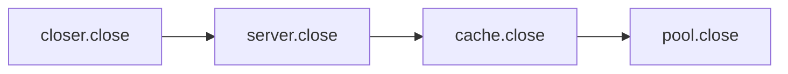
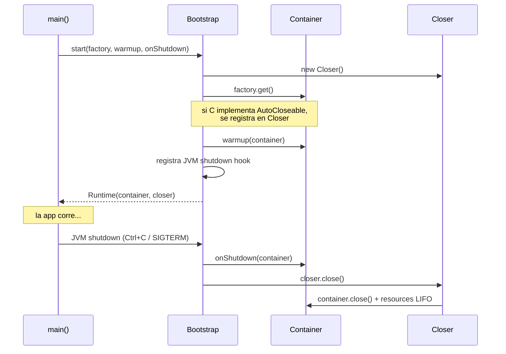

# Guía práctica: ether-di

**ether-di** provee los bloques de construcción para inyección de dependencias explícita en Java 21+.
No hay reflexión, no hay anotaciones, no hay contenedor IoC. El grafo de dependencias se construye
en Java puro y es visible, depurable y compatible con GraalVM native-image.

## Instalación

```xml
<dependency>
    <groupId>dev.rafex.ether.di</groupId>
    <artifactId>ether-di</artifactId>
    <version>1.0.0</version>
</dependency>
```

## Las tres clases

| Clase | Propósito |
|---|---|
| `Lazy<T>` | Inicialización perezosa thread-safe; el supplier se ejecuta exactamente una vez |
| `Closer` | Cierre de recursos en orden LIFO con acumulación de excepciones suprimidas |
| `Bootstrap` | Arranque de aplicación: factory → warmup → shutdown hook |

---

## Lazy\<T\> — inicialización perezosa

El supplier NO se ejecuta al construir el `Lazy`. Se ejecuta en el primer `get()` y nunca más.

```java
var config   = new Lazy<>(AppConfig::load);
var database = new Lazy<>(() -> DataSource.create(config.get()));
var cache    = new Lazy<>(() -> new RedisCache(config.get().redisUrl()));

// Solo en este punto se inicializa AppConfig
AppConfig cfg = config.get();

// Llamadas posteriores devuelven el mismo objeto
AppConfig same = config.get(); // mismo objeto, supplier no se vuelve a llamar

boolean ready = config.isInitialized(); // true
```

### Thread-safety

`Lazy` usa doble verificación de bloqueo (DCL). Múltiples hilos llamando `get()` simultáneamente
producen exactamente una inicialización — el resto espera y reciben el mismo objeto.

```java
// Seguro para 16 hilos en paralelo
var lazy = new Lazy<>(() -> new HeavyResource());
// lazy.get() llamado desde N hilos → una sola instancia creada
```

### Uso en un contenedor de dependencias

```java
public class AppContainer {

    private final Lazy<AppConfig>      config     = new Lazy<>(AppConfig::load);
    private final Lazy<DataSource>     dataSource = new Lazy<>(() ->
            DataSourceFactory.create(config.get()));
    private final Lazy<UserRepository> users      = new Lazy<>(() ->
            new JdbcUserRepository(dataSource.get()));
    private final Lazy<UserService>    service    = new Lazy<>(() ->
            new UserServiceImpl(users.get()));

    public UserService userService() { return service.get(); }
    public DataSource  dataSource()  { return dataSource.get(); }
}
```

---

## Closer — gestión de recursos en orden LIFO

`Closer` implementa `AutoCloseable`. Registra recursos y los cierra en orden inverso.
Si varios recursos lanzan excepción, propaga la primera y adjunta las demás como `suppressed`.

```java
var closer = new Closer();

var pool   = closer.register(DataSourceFactory.create(config));  // registrado 1°
var cache  = closer.register(new CacheManager());                // registrado 2°
var server = closer.register(HttpServer.start(8080));            // registrado 3°

// Al cerrar: server → cache → pool (LIFO)
try (closer) {
    runApplication(pool, cache, server);
}
```

### Flujo de cierre



### register() devuelve el mismo objeto

```java
var server = closer.register(HttpServer.start(8080));
// 'server' es el mismo objeto — sin variable temporal extra
```

### Idempotencia

```java
closer.close();
closer.close(); // no-op
closer.isClosed(); // true
```

### Manejo de múltiples excepciones

```java
var closer = new Closer();
closer.register(() -> { throw new IllegalStateException("error en A"); });
closer.register(() -> { throw new IllegalStateException("error en B"); }); // cierra primero

try {
    closer.close();
} catch (RuntimeException e) {
    // e.getMessage() == "error en B"         (primera excepción, LIFO)
    // e.getSuppressed()[0] == "error en A"   (adjunta como suprimida)
}
```

---

## Bootstrap — arranque con ciclo de vida completo

`Bootstrap` une factory → warmup → shutdown hook en una sola llamada.

```java
var runtime = Bootstrap.start(
    AppContainer::new,       // 1. Crea el contenedor
    AppContainer::warmup,    // 2. Inicializa eager (fail-fast en arranque)
    c -> c.shutdown()        // 3. Callback antes de cerrar recursos (Ctrl+C)
);
```

### Bootstrap.Runtime

El objeto devuelto es `AutoCloseable`:

```java
Bootstrap.Runtime<AppContainer> runtime = Bootstrap.start(AppContainer::new);

AppContainer container = runtime.container();
Closer       closer    = runtime.closer();

runtime.close(); // cierra closer → todos los recursos en LIFO
```

### Sobrecargas

```java
// Solo factory
Bootstrap.start(AppContainer::new);

// Factory + warmup
Bootstrap.start(AppContainer::new, AppContainer::warmup);

// Factory + warmup + onShutdown
Bootstrap.start(AppContainer::new, AppContainer::warmup, c -> LOG.info("bye"));
```

### Ciclo de vida completo



---

## Patrón completo recomendado

Combina los tres componentes para un arranque seguro con shutdown graceful:

```java
// AppContainer.java
public class AppContainer implements AutoCloseable {

    private final Closer closer = new Closer();

    // Dependencias lazy — se inicializan solo cuando se necesitan
    private final Lazy<AppConfig>      config  = new Lazy<>(AppConfig::load);
    private final Lazy<DataSource>     db      = new Lazy<>(() ->
            closer.register(DataSourceFactory.create(config.get())));
    private final Lazy<UserRepository> users   = new Lazy<>(() ->
            new JdbcUserRepository(db.get()));
    private final Lazy<UserService>    service = new Lazy<>(() ->
            new UserServiceImpl(users.get()));

    /** Warmup: inicializa toda la cadena eager para detectar errores en arranque. */
    public void warmup() {
        service.get(); // dispara config → db → users → service
    }

    public UserService userService() { return service.get(); }

    @Override
    public void close() {
        closer.close(); // cierra DataSource y demás recursos en LIFO
    }
}

// Main.java
public class Main {

    public static void main(String[] args) {
        var runtime = Bootstrap.start(
            AppContainer::new,
            AppContainer::warmup   // falla rápido si hay error de config o DB
        );

        // JVM shutdown hook ya registrado — Ctrl+C activa cierre limpio
        JettyServer.start(runtime.container());
    }
}
```

---

## Uso en tests con try-with-resources

```java
@Test
void integrationTest() throws Exception {
    try (var runtime = Bootstrap.start(TestContainer::new)) {
        var service = runtime.container().userService();
        assertNotNull(service.findById(1L));
    }
    // Closer cierra todos los recursos al salir del bloque
}
```

---

## Compatibilidad con GraalVM native-image

`ether-di` no usa reflexión, generación de proxies ni class-loading dinámico.
Compila a native-image sin ninguna configuración adicional:

```xml
<plugin>
    <groupId>org.graalvm.buildtools</groupId>
    <artifactId>native-maven-plugin</artifactId>
    <!-- No se necesita reflect-config.json ni resource-config.json para ether-di -->
</plugin>
```

---

## Comparación con alternativas

| | ether-di | Spring DI | CDI | Guice |
|---|---|---|---|---|
| Reflexión | No | Sí | Sí | Sí |
| Anotaciones | No | Sí | Sí | Sí |
| GraalVM native | Sin config | Requiere hints | Requiere hints | Requiere hints |
| Grafo visible en código | Sí | No | No | Parcial |
| Tamaño del jar | ~10 KB | ~1 MB+ | ~500 KB | ~700 KB |
| Errores detectados | En compilación | En runtime | En runtime | En runtime |

---

## Más información

- [Javadoc API](../api/doxygen/html/index.html) — documentación completa de clases y métodos
- [Código fuente](https://github.com/rafex/ether-di)
- [Ejemplo real: Kiwi](kiwi.md) — aplicación que usa ether-di junto con ether-http-jetty12
