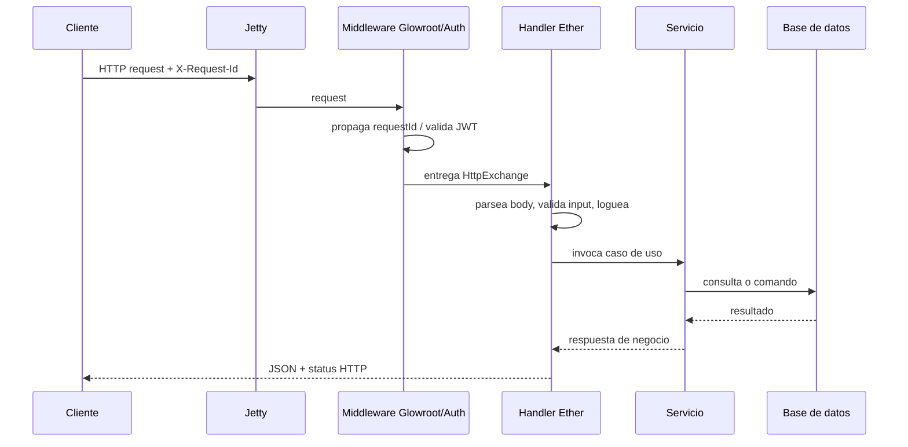

# Ejemplo práctico: Kiwi usando Ether en producción

**Kiwi** es una API REST real construida sobre Ether. Este documento toma su implementación como referencia para mostrar patrones prácticos de uso, especialmente en `ether-http-jetty12`.

El objetivo no es describir Kiwi por dentro, sino enseñar cómo construir con Ether:

1. Un servidor HTTP con Jetty 12.
2. Un endpoint real con rutas, request/response y manejo de errores.
3. Trazabilidad por request con `logger`, `requestId` y contexto.
4. Observabilidad con health probes y Glowroot.

## Dependencias Ether utilizadas

```xml
<dependency>
  <groupId>dev.rafex.ether.http</groupId>
  <artifactId>ether-http-jetty12</artifactId>
</dependency>
<dependency>
  <groupId>dev.rafex.ether.http</groupId>
  <artifactId>ether-http-security</artifactId>
</dependency>
<dependency>
  <groupId>dev.rafex.ether.jwt</groupId>
  <artifactId>ether-jwt</artifactId>
</dependency>
<dependency>
  <groupId>dev.rafex.ether.observability</groupId>
  <artifactId>ether-observability-core</artifactId>
</dependency>
<dependency>
  <groupId>dev.rafex.ether.glowroot</groupId>
  <artifactId>ether-glowroot-jetty12</artifactId>
</dependency>
```

## Arquitectura aplicada en Kiwi

```text
main/App
  -> bootstrap/container
  -> KiwiServer
     -> registro de rutas
     -> políticas de autenticación
     -> middlewares
     -> JettyServerFactory
        -> servidor embebido listo para atender requests
```

En Kiwi, la capa HTTP queda encapsulada en `kiwi-transport-jetty`, mientras que dominio, repositorios y configuración permanecen fuera del transporte. Ese es el patrón recomendado cuando se usa Ether.

## Caso práctico 1: levantar un servidor con `ether-http-jetty12`

Kiwi construye el servidor en `KiwiServer`. El patrón importante es:

1. Crear `JsonCodec`.
2. Registrar rutas.
3. Registrar middlewares.
4. Convertir esas definiciones a `JettyRouteRegistry`.
5. Crear el servidor con `JettyServerFactory`.

### Patrón real usado por Kiwi

```java
public final class KiwiServer {

    public static void start(KiwiContainer container, KiwiConfig config, List<KiwiModule> modules)
            throws Exception {
        var runner = createRunner(container, config, modules);
        runner.start();
        runner.await();
    }

    private static JettyServerRunner createRunner(
            KiwiContainer container,
            KiwiConfig config,
            List<KiwiModule> modules
    ) {
        var jsonCodec = JacksonJsonCodec.defaultCodec();
        var jwt = new KiwiJwtService(
            config.jwt().issuer(),
            config.jwt().audience(),
            config.jwt().secret()
        );
        var context = new ModuleContext(container, config, jwt);

        var routeRegistry = new RouteRegistry();
        var authPolicyRegistry = new AuthPolicyRegistry();
        var middlewareRegistry = new MiddlewareRegistry();

        for (var module : modules) {
            module.registerRoutes(routeRegistry, context);
            module.registerAuthPolicies(authPolicyRegistry, context);
            module.registerMiddlewares(middlewareRegistry, context);
        }

        var etherRoutes = new JettyRouteRegistry();
        for (var route : routeRegistry.routes()) {
            etherRoutes.add(route.pathSpec(), route.handler());
        }

        var etherMiddlewares = new ArrayList<JettyMiddleware>();
        for (var middleware : middlewareRegistry.middlewares()) {
            etherMiddlewares.add(middleware::wrap);
        }

        var etherConfig = JettyServerConfig.fromEnv();
        return JettyServerFactory.create(
            etherConfig,
            etherRoutes,
            jsonCodec,
            null,
            List.of(),
            etherMiddlewares
        );
    }
}
```

### Qué aporta este enfoque

| Pieza | Función |
|---|---|
| `JettyRouteRegistry` | Centraliza el mapeo `path -> handler` |
| `JettyServerConfig.fromEnv()` | Externaliza puerto y configuración del servidor |
| `JettyServerFactory.create(...)` | Construye el runner Jetty sin acoplar la app al bootstrap HTTP |
| `KiwiModule` | Permite agregar endpoints, auth y middlewares por módulos |

### Versión mínima recomendada para una app nueva

```java
var jsonCodec = JacksonJsonCodec.defaultCodec();
var routes = new JettyRouteRegistry();
routes.add("/hello", new HelloHandler());

var config = JettyServerConfig.fromEnv();
var runner = JettyServerFactory.create(
    config,
    routes,
    jsonCodec,
    null,
    List.of(),
    List.of()
);

runner.start();
runner.await();
```

## Caso práctico 2: registrar endpoints de forma modular

Kiwi no mete todo en `main`. Usa un módulo HTTP que concentra:

1. Las rutas.
2. Qué endpoints son públicos.
3. Qué middlewares se aplican.

### Registro real de rutas

```java
public final class DefaultKiwiModule implements KiwiModule {

    @Override
    public void registerRoutes(RouteRegistry routes, ModuleContext context) {
        var container = context.container();
        var jwt = context.jwtService();

        routes.add("/hello", new HelloHandler());
        routes.add("/health", new EnhancedHealthHandler(container.dataSource()));
        routes.add("/auth/login", new LoginHandler(jwt, container.authService(), context.config().jwt()));
        routes.add("/auth/token", new TokenHandler(jwt, container.appClientAuthService(), context.config().jwt()));
        routes.add("/objects/*", new ObjectHandler(container.objectService()));
        routes.add("/locations/*", new LocationHandler(container.locationService()));
        routes.add("/admin/app-clients", new CreateAppClientHandler(container.appClientAuthService()));
        routes.add("/*", new NotFoundHandler());
    }
}
```

### Cuándo conviene este patrón

Este estilo funciona bien cuando:

- Quieres separar transporte de dominio.
- Tienes muchos endpoints y no quieres un `main` monolítico.
- Necesitas poder agregar módulos nuevos sin reescribir el servidor.

## Caso práctico 3: crear un endpoint HTTP con `NonBlockingResourceHandler`

Kiwi usa `NonBlockingResourceHandler` como base para handlers REST. El patrón es:

1. Definir `basePath()`.
2. Declarar `routes()`.
3. Implementar `get/post/patch/delete`.
4. Responder con `JettyApiResponses` o `JettyApiErrorResponses`.

### Endpoint simple: `/hello`

```java
public class HelloHandler extends NonBlockingResourceHandler {

    private static final JsonCodec JSON_CODEC = JsonUtils.codec();
    private static final JettyApiResponses RESPONSES = new JettyApiResponses(JSON_CODEC);

    public HelloHandler() {
        super(JSON_CODEC);
    }

    @Override
    protected String basePath() {
        return "/hello";
    }

    @Override
    protected List<Route> routes() {
        return List.of(Route.of("/", Set.of("GET")));
    }

    @Override
    public boolean get(HttpExchange x) {
        var jx = (JettyHttpExchange) x;
        var name = queryParam(jx, "name");
        var message = name == null ? "Hello!!" : "Hello!! " + name.trim();
        RESPONSES.ok(jx.response(), jx.callback(), Map.of("message", message));
        return true;
    }
}
```

### Qué muestra este ejemplo

| Patrón | Uso |
|---|---|
| `basePath()` | Define el recurso base |
| `routes()` | Restringe métodos y subrutas |
| `JettyHttpExchange` | Da acceso a request, response y callback de Jetty |
| `JettyApiResponses` | Estandariza respuestas JSON |

## Caso práctico 4: endpoint con body, validación y error mapping

El ejemplo de `LocationHandler` es útil porque muestra el flujo típico de una API de negocio:

1. Leer JSON del request.
2. Validar campos.
3. Invocar el servicio de dominio.
4. Traducir errores de negocio a HTTP.
5. Registrar logs útiles.

### Patrón real de Kiwi

```java
public class LocationHandler extends NonBlockingResourceHandler {

    private static final JsonCodec JSON_CODEC = JsonUtils.codec();
    private static final JettyApiErrorResponses ERRORS = new JettyApiErrorResponses(JSON_CODEC);

    private final LocationService service;

    @Override
    protected String basePath() {
        return "/locations";
    }

    @Override
    protected List<Route> routes() {
        return List.of(Route.of("/", Set.of("POST")));
    }

    @Override
    public boolean post(HttpExchange x) {
        Log.info(getClass(), "Handling location creation request");
        return create((JettyHttpExchange) x);
    }

    private boolean create(JettyHttpExchange x) {
        try {
            var req = JSON_CODEC.readValue(
                Request.asInputStream(x.request()),
                CreateLocationRequest.class
            );

            if (req.name() == null || req.name().isBlank()) {
                ERRORS.badRequest(x.response(), x.callback(), "name is required");
                return true;
            }

            var locationId = UUID.randomUUID();
            service.create(locationId, req.name().trim(), null);

            x.json(201, "{\"location_id\":\"" + locationId + "\"}");
            return true;

        } catch (KiwiError e) {
            var mapped = KiwiErrorHttpMapper.map(e, "location.create");
            ERRORS.error(
                x.response(),
                x.callback(),
                mapped.status(),
                mapped.error(),
                mapped.code(),
                mapped.message(),
                x.path()
            );
            return true;

        } catch (Exception e) {
            Log.debug(getClass(), "Error creating location: {}", e.getMessage());
            ERRORS.internalServerError(x.response(), x.callback(), "internal_error");
            return true;
        }
    }
}
```

### Recomendaciones prácticas

- Valida pronto y responde `400` antes de tocar dominio o base de datos.
- Mantén el handler delgado: parsing HTTP + traducción de errores.
- Deja la lógica de negocio en servicios (`LocationService`, `ObjectService`, etc.).
- Usa un mapper HTTP para no dispersar códigos y mensajes de error por todos los handlers.

## Caso práctico 5: proteger rutas con JWT en `ether-http-jetty12`

Kiwi conecta `ether-jwt` con `JettyAuthHandler`. El servidor aplica la verificación como middleware y luego marca rutas públicas o protegidas.

### Políticas de autenticación

```java
@Override
public void registerAuthPolicies(AuthPolicyRegistry authPolicies, ModuleContext context) {
    authPolicies.publicPath("POST", "/admin/users");
    authPolicies.publicPath("POST", "/auth/login");
    authPolicies.publicPath("POST", "/auth/token");
    authPolicies.publicPath("GET", "/hello");
    authPolicies.publicPath("GET", "/health");

    authPolicies.protectedPrefix("/objects/*");
    authPolicies.protectedPrefix("/locations/*");
    authPolicies.protectedPrefix("/admin/app-clients");
}
```

### Middleware JWT

```java
etherMiddlewares.add(next -> {
    var auth = new JettyAuthHandler(next, (token, epochSeconds) -> {
        var verification = jwt.verify(token, epochSeconds);
        if (!verification.ok()) {
            return TokenVerificationResult.failed(verification.code());
        }
        return TokenVerificationResult.ok(verification.ctx());
    }, jsonCodec);

    for (var policy : authPolicyRegistry.policies()) {
        if (policy.type() == AuthPolicy.Type.PUBLIC_PATH) {
            auth.publicPath(policy.method(), policy.pathSpec());
        } else {
            auth.protectedPrefix(policy.pathSpec());
        }
    }
    return auth;
});
```

### Resultado

Con este patrón:

- `/health` y `/hello` quedan públicos.
- `/objects/*` y `/locations/*` exigen token válido.
- La verificación no contamina cada handler.

## Caso práctico 6: trazabilidad con logger, `requestId` y contexto

Una parte importante de Kiwi es que la trazabilidad no depende solo del APM. También usa logging estructurado a través de Ether y MDC con SLF4J.

### Wrapper de logging usado por Kiwi

```java
public final class Log {

    public static final String MDC_REQUEST_ID = "requestId";
    public static final String MDC_USER_ID = "userId";

    public static void info(Class<?> clazz, String msg, Object... args) {
        EtherLog.info(clazz, msg, args);
    }

    public static void debug(Class<?> clazz, String msg, Object... args) {
        EtherLog.debug(clazz, msg, args);
    }

    public static void error(Class<?> clazz, Throwable t, String msg, Object... args) {
        EtherLog.error(clazz, t, msg, args);
    }

    public static void withRequestContext(String requestId, String userId, Runnable task) {
        try {
            if (requestId != null) MDC.put(MDC_REQUEST_ID, requestId);
            if (userId != null) MDC.put(MDC_USER_ID, userId);
            task.run();
        } finally {
            if (requestId != null) MDC.remove(MDC_REQUEST_ID);
            if (userId != null) MDC.remove(MDC_USER_ID);
        }
    }
}
```

### Cómo se conecta con la capa HTTP

En Kiwi, `GlowrootJettyHandler` genera o propaga `X-Request-Id`:

```java
var glowroot = GlowrootJettyHandler.builder()
    .healthPath("/health")
    .requestIdHeader("X-Request-Id", true)
    .defaultSlowThreshold(2_000L)
    .build();
```

Eso permite que cada request tenga una identidad estable. El patrón recomendado para una aplicación Ether es:

1. Leer el request id desde el middleware HTTP.
2. Guardarlo en MDC.
3. Agregar `userId` cuando la autenticación ya resolvió el principal.
4. Emitir logs de negocio con ese contexto.

### Ejemplo recomendado de uso en handlers o servicios

```java
Log.withRequestContext(requestId, userId, () -> {
    Log.info(getClass(), "Creating location {}", locationId);
    service.create(locationId, name, parentId);
});
```

### Beneficio operativo

Con `requestId` en headers, logs y trazas:

- Puedes seguir una llamada de extremo a extremo.
- Puedes correlacionar fallos reportados por clientes.
- Puedes unir el log de aplicación con Glowroot usando el mismo identificador.

## Caso práctico 7: observabilidad con `ether-observability-core`

Kiwi no usa un `/health` vacío. Construye un endpoint que combina estado global, probes y métricas JVM.

### Handler real de health

```java
public class EnhancedHealthHandler extends NonBlockingResourceHandler {

    private final List<ProbeCheck> probes;

    public EnhancedHealthHandler(DataSource dataSource) {
        super(JSON_CODEC);
        this.probes = List.of(
            dbProbe(dataSource),
            memoryProbe(),
            cpuProbe(),
            diskProbe(),
            applicationProbe()
        );
    }

    @Override
    public boolean get(HttpExchange x) {
        var jx = (JettyHttpExchange) x;
        var report = ProbeAggregator.aggregate(ProbeKind.HEALTH, probes);
        var status = report.status();

        var body = new LinkedHashMap<String, Object>();
        body.put("service", "kiwi");
        body.put("status", status.name());
        body.put("timestamp", Instant.now().toString());

        int httpStatus = status == ProbeStatus.DOWN ? 503 : 200;
        RESPONSES.json(jx.response(), jx.callback(), httpStatus, body);
        return true;
    }
}
```

### Qué revisar en este patrón

| Probe | Qué valida |
|---|---|
| `dbProbe` | conectividad y validez del `DataSource` |
| `memoryProbe` | presión de heap |
| `cpuProbe` | carga de CPU |
| `diskProbe` | espacio disponible |
| `applicationProbe` | estado general del proceso |

### Recomendación

Usa `ProbeAggregator` para separar chequeos operativos del transporte HTTP. Así puedes evolucionar la política de salud sin reescribir el endpoint.

## Caso práctico 8: APM y trazas con `ether-glowroot-jetty12`

Kiwi incorpora Glowroot como middleware del servidor y como agente en runtime.

### Middleware HTTP

```java
var glowroot = GlowrootJettyHandler.builder()
    .healthPath("/health")
    .requestIdHeader("X-Request-Id", true)
    .defaultSlowThreshold(2_000L)
    .build();

middlewares.add(glowroot::wrap);
```

### Runtime del proceso

```sh
exec java \
  -XX:+UseContainerSupport \
  -XX:MaxRAMPercentage=70.0 \
  -XX:+ExitOnOutOfMemoryError \
  $JAVA_OPTS \
  -javaagent:/app/glowroot/glowroot.jar \
  -jar /app/app.jar
```

### Qué gana la aplicación

- Captura de requests lentos.
- Request id propagado por header.
- Trazas correlacionadas por endpoint.
- Instrumentación adicional por configuración Glowroot.

En el caso de Kiwi, además existe configuración local en `backend/java/observability/glowroot/config.json` para afinar reglas de captura y thresholds.

## Flujo completo de una request



## Guía rápida para replicar el patrón en otra app Ether

1. Crea un módulo de transporte que registre rutas, auth y middlewares.
2. Usa `JettyRouteRegistry` para mapear handlers.
3. Implementa cada recurso con `NonBlockingResourceHandler`.
4. Devuelve JSON con `JettyApiResponses` y errores con `JettyApiErrorResponses`.
5. Aísla JWT en un middleware con `JettyAuthHandler`.
6. Propaga `X-Request-Id` y colócalo en MDC para correlación.
7. Expón `/health` con `ProbeAggregator`.
8. Si necesitas APM, envuelve el servidor con `GlowrootJettyHandler`.

## Lecciones de Kiwi aplicables a Ether

| Decisión | Motivo |
|---|---|
| Modularizar rutas con `KiwiModule` | evita un servidor rígido y facilita evolución |
| Mantener handlers delgados | reduce acoplamiento entre HTTP y negocio |
| Centralizar auth en middleware | elimina validaciones repetidas por endpoint |
| Usar `requestId` desde el borde HTTP | mejora soporte, debugging y correlación |
| Separar health probes del handler | permite observabilidad más rica sin ensuciar transporte |
| Instrumentar Jetty con Glowroot | da trazabilidad operativa sin rehacer la app |
