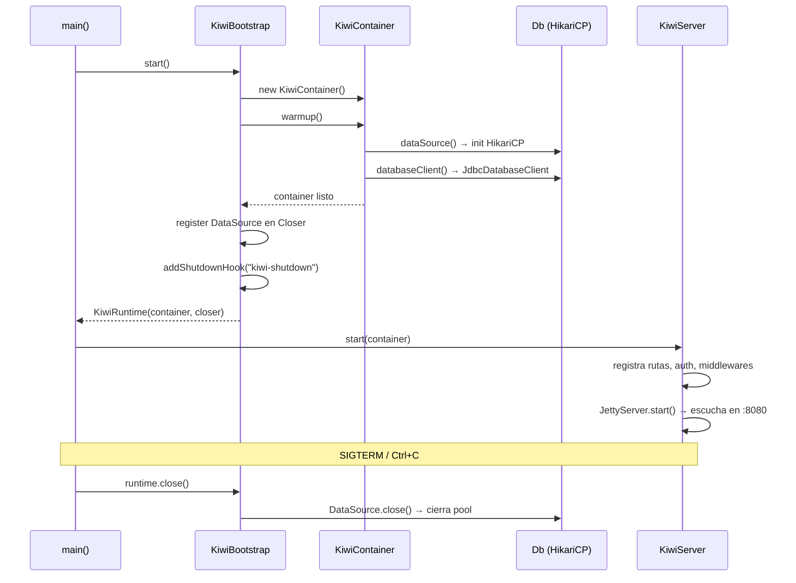

# Ejemplo: Kiwi — API REST con arquitectura hexagonal

**Kiwi** es una API REST construida sobre el ecosistema Ether con arquitectura hexagonal estricta.
Gestiona usuarios, objetos geoespaciales, roles y autenticación JWT.
Este documento muestra los patrones de integración reales usados en el proyecto.

## Dependencias Ether utilizadas

```xml
<!-- Todas con groupId de su módulo correspondiente -->
<dependency>
  <groupId>dev.rafex.ether.config</groupId>
  <artifactId>ether-config</artifactId>
</dependency>
<dependency>
  <groupId>dev.rafex.ether.di</groupId>
  <artifactId>ether-di</artifactId>
  <version>1.0.0</version>
</dependency>
<dependency>
  <groupId>dev.rafex.ether.jwt</groupId>
  <artifactId>ether-jwt</artifactId>
</dependency>
<dependency>
  <groupId>dev.rafex.ether.database</groupId>
  <artifactId>ether-database-core</artifactId>
</dependency>
<dependency>
  <groupId>dev.rafex.ether.jdbc</groupId>
  <artifactId>ether-jdbc</artifactId>
</dependency>
<dependency>
  <groupId>dev.rafex.ether.http</groupId>
  <artifactId>ether-http-jetty12</artifactId>
</dependency>
<dependency>
  <groupId>dev.rafex.ether.http</groupId>
  <artifactId>ether-http-security</artifactId>
</dependency>
<dependency>
  <groupId>dev.rafex.ether.glowroot</groupId>
  <artifactId>ether-glowroot-jetty12</artifactId>
</dependency>
```

---

## Estructura de módulos Maven

```
kiwi-parent/
├── kiwi-common/           ← tipos compartidos, config
├── kiwi-ports/            ← interfaces de repositorios y servicios
├── kiwi-core/             ← casos de uso del dominio
├── kiwi-infra-postgres/   ← implementaciones con ether-jdbc
├── kiwi-bootstrap/        ← contenedor DI (usa ether-di)
├── kiwi-transport-jetty/  ← servidor HTTP (usa ether-http-jetty12)
└── kiwi-architecture-tests/ ← reglas ArchUnit
```

---

## 1. Punto de entrada (`App.java`)

El `main` es mínimo: configura el entorno, arranca el contenedor con `Bootstrap` y delega al servidor.

```java
public class App {
    public static void main(String[] args) throws Exception {
        Locale.setDefault(Locale.ROOT);
        TimeZone.setDefault(TimeZone.getTimeZone("UTC"));

        configureLogging(args);

        try (var runtime = KiwiBootstrap.start()) {       // (1) Bootstrap
            KiwiServer.start(runtime.container());        // (2) Servidor HTTP
            // server.join() bloquea aquí hasta SIGTERM
        }
        // El try-with-resources invoca runtime.close() → cierra DataSource, etc.
    }
}
```

---

## 2. Contenedor de dependencias (`KiwiBootstrap` + `KiwiContainer`)

### Bootstrap

Antes de publicar `ether-di`, Kiwi implementó sus propias clases `Lazy`, `Closer` y un
`KiwiBootstrap` ad-hoc. Esos tres bloques son exactamente lo que `ether-di` exporta ahora.

Con `ether-di` el bootstrap se reduce a:

```java
// Con ether-di
var runtime = Bootstrap.start(
    KiwiContainer::new,   // factory
    KiwiContainer::warmup // warmup: falla rápido si la DB no responde
);
```

El `KiwiBootstrap` original hacía exactamente eso de forma manual:

```java
public final class KiwiBootstrap {

    public static KiwiRuntime start() {
        return start(new KiwiContainer(), true);
    }

    public static KiwiRuntime start(KiwiContainer container, boolean warmup) {
        var closer = new Closer();

        if (warmup) {
            container.warmup();           // falla rápido si la DB no responde
        }

        // Registra el DataSource para cerrar en shutdown
        var ds = container.dataSource();
        if (ds instanceof AutoCloseable ac) {
            closer.register(ac);
        }

        var rt = new KiwiRuntime(container, closer);
        Runtime.getRuntime().addShutdownHook(new Thread(rt::close, "kiwi-shutdown"));
        return rt;
    }
}
```

### Contenedor (`KiwiContainer`)

El contenedor cablea el grafo de dependencias con `Lazy<T>`:
cada componente se inicializa solo cuando se accede por primera vez.

```java
public final class KiwiContainer {

    private final Lazy<KiwiConfig>          config;
    private final Lazy<DataSource>          dataSource;
    private final Lazy<DatabaseClient>      databaseClient;
    private final Lazy<UserRepository>      userRepository;
    private final Lazy<AuthService>         authService;
    // ... más Lazy<T> para cada servicio/repositorio

    public KiwiContainer(Overrides overrides) {
        // Cada Lazy toma un Supplier; "select" permite inyectar overrides para tests
        config         = new Lazy<>(select(overrides.config(), KiwiConfig::load));
        dataSource     = new Lazy<>(select(overrides.dataSource(), () -> Db.dataSource()));
        databaseClient = new Lazy<>(() -> Db.databaseClient());

        userRepository = new Lazy<>(select(overrides.userRepository(),
                             () -> new UserRepositoryImpl(databaseClient())));
        authService    = new Lazy<>(select(overrides.authService(),
                             () -> new AuthServiceImpl(userRepository(), passwordHasher())));
        // ...
    }

    /** Warmup: toca todos los nodos para fallar rápido en startup. */
    public void warmup() {
        config(); dataSource(); databaseClient();
        userRepository(); authService();
        // ...
    }
}
```

### Override para tests

```java
// En un test de integración se puede reemplazar cualquier componente:
var container = new KiwiContainer(
    KiwiContainer.Overrides.builder()
        .dataSource(() -> testDataSource)
        .build()
);
```

---

## 3. Base de datos (`ether-jdbc` + HikariCP)

### Inicialización del pool

```java
public final class Db {

    private static volatile HikariDataSource DS;
    private static volatile DatabaseClient   CLIENT;

    public static synchronized void init(DatabaseConfig config) {
        if (DS != null) return; // idempotente

        var hikari = new HikariConfig();
        hikari.setJdbcUrl(config.url());
        hikari.setUsername(config.user());
        hikari.setPassword(config.password());
        hikari.setMaximumPoolSize(config.maxPoolSize());
        hikari.setPoolName("kiwi-pool");
        // caché de prepared statements PostgreSQL
        hikari.addDataSourceProperty("preparedStatementCacheQueries", "256");

        DS     = new HikariDataSource(hikari);
        CLIENT = new JdbcDatabaseClient(DS);   // ether-jdbc
    }

    public static DatabaseClient databaseClient() {
        ensureInitialized();
        return CLIENT;
    }
}
```

### Repositorio con `DatabaseClient`

```java
public class UserRepositoryImpl implements UserRepository {

    private final DatabaseClient db;

    @Override
    public void createUser(UUID userId, String username, byte[] passwordHash, ...) {
        db.execute(new SqlQuery("""
            INSERT INTO users (user_id, username, password_hash, ...)
            VALUES (?, ?, ?, ...)
            """,
            List.of(
                SqlParameter.of(userId),
                SqlParameter.text(username),
                SqlParameter.of(passwordHash)
            )
        ));
    }

    @Override
    public Optional<UserRow> findByUsername(String username) {
        return db.queryOne(
            new SqlQuery("SELECT * FROM users WHERE username = ?",
                         List.of(SqlParameter.text(username))),
            rs -> new UserRow(
                ResultSets.getUuid(rs, "user_id"),
                rs.getString("username"),
                rs.getBytes("password_hash")
            )
        );
    }
}
```

---

## 4. JWT (`ether-jwt`)

### Configuración y emisión

```java
public final class KiwiJwtService {

    private final TokenIssuer  issuer;
    private final TokenVerifier verifier;

    public KiwiJwtService(String iss, String aud, String secret) {
        var keyProvider = KeyProvider.hmac(secret);           // ether-jwt
        var config = JwtConfig.builder(keyProvider)
            .expectedIssuer(iss)
            .expectedAudience(aud)
            .build();

        this.issuer   = new DefaultTokenIssuer(config);
        this.verifier = new DefaultTokenVerifier(config);
    }

    /** Emite un token de usuario con roles y TTL. */
    public String mint(String sub, Collection<String> roles, long ttlSeconds) {
        var spec = TokenSpec.builder()
            .subject(sub)
            .issuer(iss).audience(aud)
            .issuedAt(Instant.now())
            .ttl(Duration.ofSeconds(ttlSeconds))
            .roles(roles.toArray(String[]::new))
            .tokenType(TokenType.USER)
            .build();
        return issuer.issue(spec);
    }

    /** Verifica el token y devuelve el contexto de autenticación. */
    public VerifyResult verify(String token, long nowEpochSeconds) {
        var result = verifier.verify(token, Instant.ofEpochSecond(nowEpochSeconds));
        if (!result.ok()) return VerifyResult.bad(result.code());
        return VerifyResult.ok(toContext(result.claims().orElseThrow()));
    }
}
```

---

## 5. Servidor HTTP (`ether-http-jetty12`)

### Registro modular de rutas, auth y middlewares

```java
public final class DefaultKiwiModule implements KiwiModule {

    @Override
    public void registerRoutes(RouteRegistry routes, ModuleContext ctx) {
        var c   = ctx.container();
        var jwt = ctx.jwtService();

        routes.add("/health",     new EnhancedHealthHandler(c.dataSource()));
        routes.add("/auth/login", new LoginHandler(jwt, c.authService(), ctx.config().jwt()));
        routes.add("/objects/*",  new ObjectHandler(c.objectService()));
        routes.add("/locations/*", new LocationHandler(c.locationService()));
    }

    @Override
    public void registerAuthPolicies(AuthPolicyRegistry auth, ModuleContext ctx) {
        // Rutas públicas (sin JWT)
        auth.publicPath("POST", "/auth/login");
        auth.publicPath("GET",  "/health");

        // Rutas protegidas (requieren JWT válido)
        auth.protectedPrefix("/objects/*");
        auth.protectedPrefix("/locations/*");
    }

    @Override
    public void registerMiddlewares(MiddlewareRegistry mw, ModuleContext ctx) {
        // APM con Glowroot (ether-glowroot-jetty12)
        var glowroot = GlowrootJettyHandler.builder()
            .healthPath("/health")
            .requestIdHeader("X-Request-Id", true)
            .defaultSlowThreshold(2_000L)
            .build();
        mw.add(glowroot::wrap);
    }
}
```

### Middleware JWT integrado en el servidor

```java
// En KiwiServer.createRunner()
etherMiddlewares.add(next -> {
    var auth = new JettyAuthHandler(next, (token, epochSeconds) -> {
        var result = jwt.verify(token, epochSeconds);
        if (!result.ok()) return TokenVerificationResult.failed(result.code());
        return TokenVerificationResult.ok(result.ctx());
    }, jsonCodec);

    // Aplica las políticas registradas por los módulos
    for (var policy : authPolicyRegistry.policies()) {
        if (policy.type() == AuthPolicy.Type.PUBLIC_PATH) {
            auth.publicPath(policy.method(), policy.pathSpec());
        } else {
            auth.protectedPrefix(policy.pathSpec());
        }
    }
    return auth;
});
```

---

## 6. Seguridad (`ether-http-security`)

```java
// CORS permisivo para desarrollo; en producción usar CorsPolicy.builder()
var cors       = CorsPolicy.permissive();
var secHeaders = SecurityHeadersPolicy.defaults();

middlewares.add(next -> new Handler.Wrapper(next) {
    @Override
    public boolean handle(Request request, Response response, Callback callback) {
        var origin = Request.getHeaders(request).get("Origin");
        cors.responseHeaders(origin)
            .forEach((k, v) -> response.getHeaders().add(k, v));
        secHeaders.headers()
            .forEach((k, v) -> response.getHeaders().add(k, v));
        return super.handle(request, response, callback);
    }
});
```

---

## Flujo completo de arranque



---

## Lecciones aprendidas

| Decisión | Por qué |
|---|---|
| `Lazy<T>` para cada dependencia | Startup rápido; los componentes no usados nunca se inicializan |
| `warmup()` explícito | Falla en startup en lugar de en la primera petición real |
| `Bootstrap` + `Closer` | El DataSource se cierra limpiamente en SIGTERM sin código extra |
| Módulos (`KiwiModule`) | Permite añadir grupos de rutas/auth/middlewares sin tocar el servidor |
| Un solo `DatabaseClient` por app | HikariCP gestiona el pool; `JdbcDatabaseClient` es stateless |
| `SecurityHeadersPolicy.defaults()` | CSP, X-Frame-Options, HSTS gratis desde ether-http-security |
