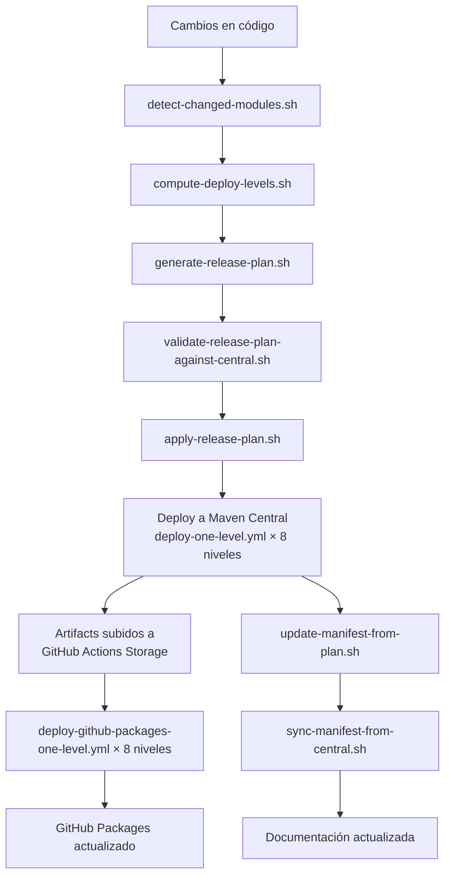

# Scripts de Automatización - Ether Deployment Hub

## Visión General

El sistema de automatización del Ether Deployment Hub está compuesto por 16 scripts Bash que orquestan el ciclo completo de publicación de módulos Java a Maven Central y GitHub Packages. Estos scripts implementan un pipeline robusto que incluye detección de cambios, planificación de releases, validación contra Maven Central, despliegue ordenado y documentación automática.

## Arquitectura del Sistema

### Flujo de Trabajo Principal

### CI Workflows (arquitectura separada)

El pipeline de publicación está dividido en dos workflows independientes para mayor resiliencia y facilidad de re-ejecución:

#### `publish-java-modules-maven-central.yml`
- Despliega los 27 módulos a Maven Central en 8 niveles topológicos (L0–L7).
- Sube los JARs/POMs compilados como **GitHub Actions artifacts** (`maven-artifacts-level-N`) para uso posterior.
- Sube el `release-plan` artifact para consumo del workflow de GitHub Packages.
- Trigger: tag push o `workflow_dispatch`.

#### `publish-java-modules-gh-pkg.yml`
- Se dispara automáticamente vía `workflow_run` cuando el workflow de Maven Central completa con éxito.
- También soporta `workflow_dispatch` con `maven_central_run_id` para re-ejecuciones manuales.
- Descarga los JARs del workflow de Maven Central (no de `repo1.maven.apache.org`) → elimina dependencia de propagación de Central.
- Firma con GPG y sube a `maven.pkg.github.com`.

#### `deploy-one-level.yml` (reusable)
- Despliega un nivel de dependencias a Maven Central secuencialmente.
- Al finalizar, recoge los artifacts de `~/.m2/repository` y los sube como `maven-artifacts-level-N`.
- Timeout: 30 minutos. Máx. 5 módulos por nivel (`MAX_LEVEL_SIZE=5`).

#### `deploy-github-packages-one-level.yml` (reusable)
- Descarga `maven-artifacts-level-N` del run de Maven Central vía `run-id`.
- Restaura los JARs al repositorio Maven local.
- Firma con GPG (`MAX_GH_PARALLEL=4`) y despliega a GitHub Packages.
- Timeout: 30 minutos. No recompila desde fuente.

### Scripts por Categoría

#### 1. **Detección y Análisis de Cambios**
- `detect-changed-modules.sh` - Identifica módulos modificados desde un commit base
- `compute-deploy-levels.sh` - Calcula niveles topológicos con Kahn's algorithm + chunking `MAX_LEVEL_SIZE=5`

#### 2. **Planificación de Releases**
- `generate-release-plan.sh` - Genera un plan de release con versiones incrementadas
- `validate-release-plan-against-central.sh` - Valida que las versiones no colisionen en Maven Central

#### 3. **Ejecución de Despliegue**
- `apply-release-plan.sh` - Aplica las versiones del plan a los `pom.xml` antes del build
- `deploy-to-github-packages.sh` - Firma y despliega a GitHub Packages (usado por `deploy-github-packages-one-level.yml`)

#### 4. **Sincronización y Estado**
- `sync-manifest-from-central.sh` - Sincroniza el manifest.json con Maven Central
- `update-manifest-from-plan.sh` - Actualiza el manifest después del despliegue exitoso
- `generate-maven-central-status.sh` - Genera tabla de estado de módulos en Maven Central
- `latest-maven-version.sh` - Consulta la última versión de un módulo en Maven Central

#### 5. **Documentación**
- `generate-doxygen-docs.sh` - Genera documentación API con Doxygen localmente
- `doxygenw.sh` - Genera documentación API con Doxygen en Docker
- `render-readme.sh` - Renderiza README.md desde plantilla

#### 6. **Utilidades y Mantenimiento**
- `release-common.sh` - Funciones comunes para todos los scripts de release
- `pull-subtrees.sh` - Muestra y sincroniza subtrees Git desde `releases/subtrees.json`
- `setup-hooks.sh` - Configura hooks Git para el proyecto

## Scripts Revisados (Estado Actual)

### 1. `generate-doxygen-docs.sh`
**Propósito**: Genera documentación API usando Doxygen localmente.

**Características clave**:
- Detecta automáticamente directorios de código fuente desde `manifest.json`
- Fallback a lista hardcodeada si `jq` no está disponible
- Crea Doxyfile temporal con rutas de entrada dinámicas
- Manejo robusto de errores con `set -euo pipefail`

### 2. `doxygenw.sh`
**Propósito**: Genera documentación API usando Doxygen en contenedor Docker.

**Características clave**:
- Compatibilidad multiplataforma (especialmente ARM64/macOS)
- Mapeo de volúmenes Docker con permisos de usuario correctos
- Detección automática de arquitectura para evitar warnings

### 3. `release-common.sh`
**Propósito**: Biblioteca de funciones comunes para scripts de release.

**Funciones principales**:
- `release_root_dir()` - Obtiene directorio raíz del proyecto
- `release_level_rank()` - Convierte niveles semánticos a valores numéricos
- `release_max_level()` - Determina el nivel máximo entre dos
- `release_normalize_semver()` - Normaliza versiones semánticas
- `release_bump_version()` - Incrementa versiones según nivel
- `release_default_base_ref()` - Determina commit base para comparación
- `release_is_docs_or_meta_file()` - Identifica archivos de documentación/metadata
- `release_is_build_file()` - Identifica archivos de build
- `release_commit_level_for_log()` - Analiza mensajes de commit para determinar nivel

### 4. `compute-deploy-levels.sh`
**Propósito**: Calcula niveles de despliegue con ordenamiento topológico.

**Características clave**:
- Implementa el algoritmo de Kahn para ordenamiento topológico de dependencias
- `MAX_LEVEL_SIZE=5` (configurable vía `$2`): divide niveles grandes en sub-niveles para respetar el timeout de 30 min de GitHub Actions
- Para los 27 módulos actuales produce 8 niveles: `L0(1) L1(5) L2(5) L3(2) L4(5) L5(5) L6(3) L7(1)`
- Salida JSON: `{"levels": [["mod-a", "mod-b"], ["mod-c"], ...]}`

### 5. `deploy-to-github-packages.sh`
**Propósito**: Firma y despliega artefactos a GitHub Packages.

**Características clave**:
- `MAX_GH_PARALLEL=4`: semáforo FIFO para limitar procesos GPG concurrentes y evitar `Cannot allocate memory`
- Lee `groupId`/`artifactId` de `releases/manifest.json` (no del release plan, que los tiene como `null`)
- Usa `mvn gpg:sign-and-deploy-file` para firma y deploy en un solo paso

## Mejores Prácticas del Pipeline

### 1. **Manejo de Errores**
- Todos los scripts usan `set -euo pipefail` para fail-fast
- Mensajes de error claros dirigidos a `stderr`
- Validación de precondiciones antes de ejecutar lógica principal

### 2. **Portabilidad**
- Compatibilidad multiplataforma (Linux, macOS, Docker)
- Detección automática de herramientas (`jq`, `docker`)
- Fallbacks elegantes cuando herramientas no están disponibles

### 3. **Mantenibilidad**
- Funciones comunes centralizadas en `release-common.sh`
- Configuración mediante variables de entorno
- Logging consistente y formatado con separadores visuales (`═══`)

### 4. **Seguridad**
- Uso de `mktemp` para archivos temporales
- Limpieza automática con `trap`
- Permisos de usuario apropiados en contenedores Docker

### 5. **Idempotencia**
- Los scripts pueden ejecutarse múltiples veces sin efectos secundarios
- Validación contra estado externo (Maven Central)
- Skip de módulos ya publicados (`already exists` en Sonatype Central)

### 6. **Resiliencia en red** ✅
- `deploy-github-packages-one-level.yml` descarga artifacts de GitHub Actions Storage en lugar de `repo1.maven.apache.org`, eliminando dependencia de propagación de Maven Central
- `curl_retry()` con 5 reintentos y 30s de espera usado en operaciones de red opcionales

## Orden de Despliegue

Basado en `releases/manifest.json` y `MAX_LEVEL_SIZE=5`, el orden actual es:

| Nivel | Módulos |
|-------|---------|
| L0 | `ether-parent` |
| L1 | `ether-ai-core`, `ether-config`, `ether-crypto`, `ether-database-core`, `ether-http-core` |
| L2 | `ether-http-security`, `ether-json`, `ether-logging-core`, `ether-observability-core`, `ether-websocket-core` |
| L3 | `ether-ai-deepseek`, `ether-ai-openai`, `ether-database-postgres`, `ether-http-client`, `ether-http-openapi` |
| L4 | `ether-http-problem`, `ether-jdbc`, `ether-jwt`, `ether-websocket-jetty12` |
| L5 | `ether-http-jetty12`, `ether-webhook` |
| L6 | `ether-glowroot-jetty12` |

## Convenciones CI/Runtime

- GitHub workflows fuerzan JavaScript actions a Node 24 via `FORCE_JAVASCRIPT_ACTIONS_TO_NODE24=true`
- Publicación a Central espera disponibilidad con `central.waitUntil=published` (configurable)
- **Java 25 LTS** (Temurin) en todos los workflows desde la rama `migrate-jdk25`

## Make targets (CI)

| Target | Descripción |
|--------|-------------|
| `make deploy` | Install local + genera release plan |
| `make publish-ci` | Lanza workflow Maven Central (`run_deploy=true`) |
| `make publish-plan-ci` | Dry-run Maven Central (`run_deploy=false`) |
| `make publish-gh-pkg-ci RUN_ID=<id>` | Re-trigger manual de GitHub Packages |
| `make gh-runs` | Lista runs recientes de ambos workflows |
| `make gh-watch RUN_ID=<id>` | Observa un run específico |
| `make gh-logs RUN_ID=<id>` | Logs de un run específico |

## Stack de Documentación (Fase 1)

- Doxygen + Graphviz para documentación API Java
- Configuración principal: `Doxyfile` (raíz)
- Script wrapper Docker: `scripts/doxygenw.sh` (ejecutor por defecto)
- Comandos `make` disponibles:
  - `make docs-gen` - Genera documentación
  - `make docs-gen-docker` - Genera con Docker
  - `make docs-gen-local` - Genera localmente
  - `make docs-ci` - Ejecuta en CI
  - `make docs-clean` - Limpia documentación
- Workflow CI: `.github/workflows/generate-doxygen-docs.yml`
  - Construye docs en PR/push
  - Publica a GitHub Pages en `main`/ejecuciones manuales
  - Path de upload: `docs/api/doxygen/html`

## Próximos Pasos

1. ✅ ~~Artifact sharing entre workflows Maven Central → GitHub Packages~~
2. ✅ ~~Separar `publish-java-modules.yml` en dos workflows independientes~~
3. ✅ ~~Migración a Java 25 LTS~~
4. ✅ ~~Retries robustos para operaciones de red~~
5. [ ] Implementar Structured Concurrency (JEP 505) en módulos AI cuando se estabilice
6. [ ] Agregar métricas de ejecución (tiempos, éxito/fallo por nivel)
7. [ ] Tests unitarios para funciones en `release-common.sh`
8. [ ] Logging estructurado (JSON) para análisis de pipeline

---

*Última actualización: 22 de marzo de 2026*
*Scripts revisados: 5 de 16*
*Estado: En progreso*
