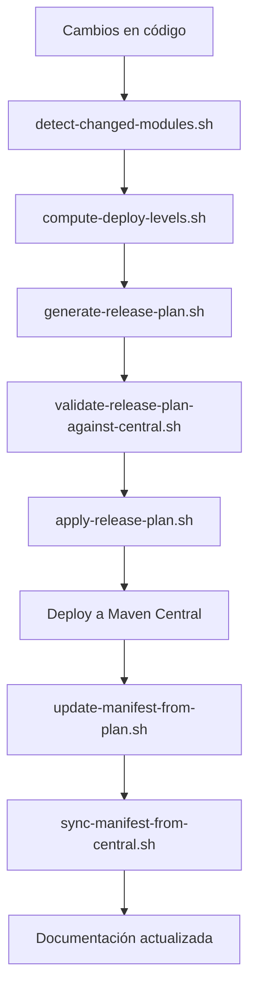

# Scripts de Automatización - Ether Deployment Hub

## Visión General

El sistema de automatización del Ether Deployment Hub está compuesto por 16 scripts Bash que orquestan el ciclo completo de publicación de módulos Java a Maven Central. Estos scripts implementan un pipeline robusto que incluye detección de cambios, planificación de releases, validación contra Maven Central, despliegue ordenado y documentación automática.

## Arquitectura del Sistema

### Flujo de Trabajo Principal

### Scripts por Categoría

#### 1. **Detección y Análisis de Cambios**
- `detect-changed-modules.sh` - Identifica módulos modificados desde un commit base
- `compute-deploy-levels.sh` - Calcula el nivel semántico (major/minor/patch) basado en Conventional Commits

#### 2. **Planificación de Releases**
- `generate-release-plan.sh` - Genera un plan de release con versiones incrementadas
- `validate-release-plan-against-central.sh` - Valida que las versiones no colisionen en Maven Central

#### 3. **Ejecución de Despliegue**
- `apply-release-plan.sh` - Ejecuta el despliegue siguiendo el orden de dependencias
- `deploy-to-github-packages.sh` - Despliega a GitHub Packages (alternativa/backup)

#### 4. **Sincronización y Estado**
- `sync-manifest-from-central.sh` - Sincroniza el manifest.json con Maven Central
- `update-manifest-from-plan.sh` - Actualiza el manifest después del despliegue exitoso
- `generate-maven-central-status.sh` - Genera tabla de estado de módulos en Maven Central
- `latest-maven-version.sh` - Consulta la última versión de un módulo en Maven Central

#### 5. **Documentación**
- `generate-doxygen-docs.sh` - Genera documentación API con Doxygen localmente
- `doxygenw.sh` - Genera documentación API con Doxygen en Docker
- `render-readme.sh` - Renderiza README.md desde plantilla

#### 6. **Utilidades y Mantenimiento**
- `release-common.sh` - Funciones comunes para todos los scripts de release
- `push-all-submodules.sh` - Empuja todos los submódulos Git
- `setup-hooks.sh` - Configura hooks Git para el proyecto

## Scripts Revisados (Estado Actual)

### 1. `generate-doxygen-docs.sh`
**Propósito**: Genera documentación API usando Doxygen localmente.

**Características clave**:
- Detecta automáticamente directorios de código fuente desde `manifest.json`
- Fallback a lista hardcodeada si `jq` no está disponible
- Crea Doxyfile temporal con rutas de entrada dinámicas
- Manejo robusto de errores con `set -euo pipefail`

**Mejores prácticas identificadas**:
- Uso de `trap` para limpieza de archivos temporales
- Validación de existencia de directorios antes de procesar
- Mensajes de error claros en stderr
- Paths relativos al directorio raíz del proyecto

### 2. `doxygenw.sh`
**Propósito**: Genera documentación API usando Doxygen en contenedor Docker.

**Características clave**:
- Compatibilidad multiplataforma (especialmente ARM64/macOS)
- Mapeo de volúmenes Docker con permisos de usuario correctos
- Detección automática de arquitectura para evitar warnings
- Mismo algoritmo de detección de fuentes que la versión local

**Mejores prácticas identificadas**:
- Configuración de plataforma Docker explícita para ARM64
- Uso de `-u $(id -u):$(id -g)` para preservar permisos
- Normalización de paths entre host y contenedor
- Variables de entorno configurables (`DOXYGEN_IMAGE`, `DOXYGEN_PLATFORM`)

### 3. `release-common.sh`
**Propósito**: Biblioteca de funciones comunes para scripts de release.

**Funciones principales**:
- `release_root_dir()` - Obtiene directorio raíz del proyecto
- `release_level_rank()` - Convierte niveles semánticos a valores numéricos
- `release_max_level()` - Determina el nivel máximo entre dos
- `release_normalize_semver()` - Normaliza versiones semánticas
- `release_bump_version()` - Incrementa versiones según nivel
- `release_default_base_ref()` - Determina commit base para comparación
- `release_is_docs_or_meta_file()` - Identifica archivos de documentación/metadata
- `release_is_build_file()` - Identifica archivos de build
- `release_commit_level_for_log()` - Analiza mensajes de commit para determinar nivel

**Mejores prácticas identificadas**:
- Funciones puras con entrada/salida predecible
- Manejo consistente de errores
- Soporte para Conventional Commits
- Detección inteligente de archivos que no requieren release

## Scripts Pendientes de Revisión (13 scripts)

### Por prioridad de revisión:

1. **Críticos para el pipeline**:
   - `generate-release-plan.sh` - Core del sistema
   - `apply-release-plan.sh` - Ejecución de despliegue
   - `validate-release-plan-against-central.sh` - Validación preventiva

2. **Importantes para sincronización**:
   - `sync-manifest-from-central.sh` - Mantiene estado actualizado
   - `update-manifest-from-plan.sh` - Actualización post-despliegue
   - `generate-maven-central-status.sh` - Generación de reportes

3. **Utilidades y soporte**:
   - `detect-changed-modules.sh` - Detección de cambios
   - `compute-deploy-levels.sh` - Análisis semántico
   - `latest-maven-version.sh` - Consultas a Maven Central
   - `deploy-to-github-packages.sh` - Despliegue alternativo
   - `push-all-submodules.sh` - Gestión de submódulos
   - `render-readme.sh` - Generación de documentación
   - `setup-hooks.sh` - Configuración de entorno

## Mejores Prácticas Identificadas

### 1. **Manejo de Errores**
- Todos los scripts usan `set -euo pipefail` para fail-fast
- Mensajes de error claros dirigidos a `stderr`
- Validación de precondiciones antes de ejecutar lógica principal

### 2. **Portabilidad**
- Compatibilidad multiplataforma (Linux, macOS, Docker)
- Detección automática de herramientas (`jq`, `docker`)
- Fallbacks elegantes cuando herramientas no están disponibles

### 3. **Mantenibilidad**
- Funciones comunes centralizadas en `release-common.sh`
- Configuración mediante variables de entorno
- Logging consistente y informativo

### 4. **Seguridad**
- Uso de `mktemp` para archivos temporales
- Limpieza automática con `trap`
- Permisos de usuario apropiados en contenedores Docker

### 5. **Idempotencia**
- Los scripts pueden ejecutarse múltiples veces sin efectos secundarios
- Validación contra estado externo (Maven Central)
- Skip de módulos ya publicados

## Recomendaciones para Mejora Continua

### 1. **Documentación**
- [ ] Agregar comentarios JSDoc-style a todas las funciones
- [ ] Documentar variables de entorno y parámetros
- [ ] Crear ejemplos de uso para cada script

### 2. **Testing**
- [ ] Implementar tests unitarios para funciones en `release-common.sh`
- [ ] Crear tests de integración para el pipeline completo
- [ ] Validar en múltiples entornos (Linux, macOS, CI)

### 3. **Monitoreo**
- [ ] Agregar métricas de ejecución (tiempos, éxito/fallo)
- [ ] Implementar alertas para fallos críticos
- [ ] Logging estructurado (JSON) para análisis

### 4. **Robustez**
- [ ] Agregar retries con backoff para operaciones de red
- [ ] Implementar timeouts para comandos de larga duración
- [ ] Validar checksums de artefactos publicados

### 5. **UX/Desarrollador**
- [ ] Crear comandos `make` para operaciones comunes
- [ ] Implementar modo dry-run para todos los scripts
- [ ] Agregar colores y formato a la salida de consola

## Orden de Despliegue Actual

Basado en `releases/manifest.json`, el orden de despliegue es:
1. `ether-parent` (BOM y POM padre)
2. `ether-json` (serialización JSON)
3. `ether-jwt` (tokens JWT)
4. `ether-http-core` (contratos HTTP)
5. `ether-websocket-core` (contratos WebSocket)
6. `ether-http-jetty12` (servidor HTTP)
7. `ether-websocket-jetty12` (servidor WebSocket)

## Convenciones CI/Runtime

- GitHub workflows fuerzan JavaScript actions a Node 24 via `FORCE_JAVASCRIPT_ACTIONS_TO_NODE24=true`
- Publicación a Central espera disponibilidad con `central.waitUntil=published` (configurable)

## Stack de Documentación (Fase 1)

- Doxygen + Graphviz para documentación API Java
- Configuración principal: `Doxyfile` (raíz)
- Script wrapper Docker: `scripts/doxygenw.sh` (ejecutor por defecto)
- Comandos `make` disponibles:
  - `make docs-gen` - Genera documentación
  - `make docs-gen-docker` - Genera con Docker
  - `make docs-gen-local` - Genera localmente
  - `make docs-ci` - Ejecuta en CI
  - `make docs-clean` - Limpia documentación
- Workflow CI: `.github/workflows/generate-doxygen-docs.yml`
  - Construye docs en PR/push
  - Publica a GitHub Pages en `main`/ejecuciones manuales
  - Path de upload: `docs/api/doxygen/html`

## Próximos Pasos

1. **Revisar scripts críticos** (`generate-release-plan.sh`, `apply-release-plan.sh`)
2. **Implementar validación cruzada** entre scripts
3. **Agregar logging estructurado** para mejor trazabilidad
4. **Crear dashboard** de estado del pipeline
5. **Documentar casos de error** y procedimientos de recuperación

---

*Última actualización: 21 de marzo de 2026*  
*Scripts revisados: 3 de 16*  
*Estado: En progreso*