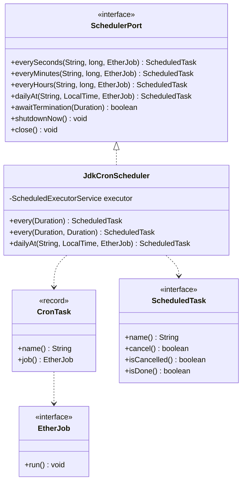

# ether-cron

**Group ID:** `dev.rafex.ether.cron`
**Artifact ID:** `ether-cron`
**Packaging:** `jar`
**License:** MIT

`ether-cron` is a small embedded scheduler for Ether applications. The first
version intentionally uses only the JDK `ScheduledExecutorService`: no Spring,
no Quartz, no durable job platform. It covers simple recurring tasks with a
stable API that can later accept a cron expression adapter without changing
application code.

## Maven dependency

```xml
<dependency>
    <groupId>dev.rafex.ether.cron</groupId>
    <artifactId>ether-cron</artifactId>
    <version>9.5.5-SNAPSHOT</version>
</dependency>
```

If your project inherits from `ether-parent` or imports it as a BOM, omit the
`<version>` tag.

## Architecture overview



## Quick start

```java
import dev.rafex.ether.cron.CronSchedulers;

var scheduler = CronSchedulers.singleThread();

Runtime.getRuntime().addShutdownHook(new Thread(scheduler::close));

scheduler.everySeconds("heartbeat", 30, () -> {
    System.out.println("Ether heartbeat...");
});
```

## Supported schedules

```java
scheduler.everySeconds("poller", 10, poller::run);
scheduler.everyMinutes("cache-refresh", 5, cache::refresh);
scheduler.everyHours("cleanup", 1, cleanup::run);
scheduler.dailyAt("daily-report", LocalTime.of(7, 30), report::send);
```

`dailyAt` recalculates the next run after each execution, so it follows local
clock changes instead of blindly running every 24 fixed hours.

For lower-level control, use `every(String, Duration, EtherJob)` or
`every(String, Duration, Duration, EtherJob)` on `JdkCronScheduler`:

```java
scheduler.every("startup-check", Duration.ZERO, Duration.ofMinutes(5), checks::run);
```

## Error handling

Job exceptions are caught by the scheduler so one failed execution does not
stop future executions. By default failures are written to standard error:

```text
Job failed: heartbeat - timeout
```

For custom handling, create `JdkCronScheduler` with your own failure consumer.
If the failure consumer itself throws, the scheduler catches that exception too
so future executions are not cancelled.

## Shutdown

```java
scheduler.close();
scheduler.awaitTermination(Duration.ofSeconds(5));
```

Use `shutdownNow()` when you need to ask the executor to interrupt running work.

## Why no cron-utils yet?

The initial module starts with zero runtime dependencies. Real cron expression
support should live in a later adapter, for example `ether-cron-utils-adapter`,
using `cron-utils` to parse and calculate next executions while keeping
execution in this module controlled by Java's `ScheduledExecutorService`.
